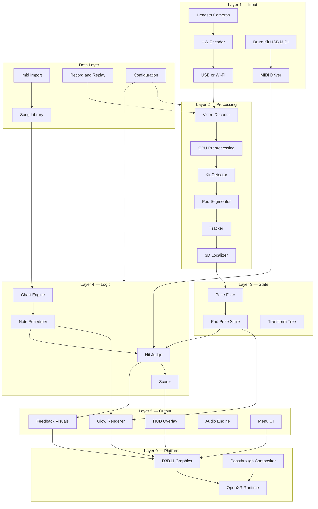

# VRDrummer — Design Document

**Version:** 7.0
**Last updated:** June 2026
**Repository:** [github.com/AbhijeetPatil5/VRDrummer](https://github.com/AbhijeetPatil5/VRDrummer)
**Status:** Authoritative architecture, implementation, and learning reference

---

## Table of Contents

1. [Vision and Scope](#1-vision-and-scope)
2. [Reference Configuration](#2-reference-configuration)
3. [System Architecture](#3-system-architecture)
4. [Performance and Concurrency Architecture](#4-performance-and-concurrency-architecture)
5. [Infrastructure and Tooling](#5-infrastructure-and-tooling)
6. [Interface Contracts](#6-interface-contracts)
7. [Technology Stack](#7-technology-stack)
8. [Build Roadmap](#8-build-roadmap)
9. [Latency and Bandwidth Budget](#9-latency-and-bandwidth-budget)
10. [Implementation Reference](#10-implementation-reference)
11. [Developer Learning Path](#11-developer-learning-path)
12. [Glossary](#12-glossary)

---


## 1. Vision and Scope


### Product Vision

VRDrummer is a mixed-reality application that teaches drumming through visual cues overlaid on a real electronic drum kit. The player wears a VR headset with passthrough enabled, sees their physical kit through the headset cameras, and receives timed glow cues on each pad. The player uploads a drum chart (`.mid` file or similar), the application decodes it into a timed sequence of pad hits, and renders approach cues so the player knows which pad to hit and when. Strikes are captured via real drumsticks hitting real pads — no VR controllers involved.

### Core User Experience

```text
Put on headset → see your real drum kit through passthrough → select a song →
see glowing cue circles approach each pad in time with the music →
hit the pad when the cue arrives → get instant visual feedback (hit/miss) →
see your score → improve over time
```


### Product MVP

The full product is ready when a user can:

1. Put on the headset and see their drum kit through passthrough
2. Load a `.mid` drum chart from storage
3. See timed glow cues on the correct pads, synced to a backing track or metronome
4. Hit pads with real drumsticks; hits detected via USB MIDI
5. Receive per-hit judgment (perfect / great / good / miss) with visual feedback
6. See a final score and accuracy breakdown after the song


### Perception MVP (First "It Works" Moment)

Before gameplay can exist, the perception pipeline must prove itself:

- Live passthrough camera frames decoded on PC
- Drum kit localised; all pad positions identified
- Stable pad poses via pluggable pose filter (default EKF)
- Glow circles composited over real pads via passthrough layers
- No music chart or hit timing logic required — just static glows proving pose accuracy


### Nomenclature


| Term          | Meaning                                              | Example                              |
| ------------- | ---------------------------------------------------- | ------------------------------------ |
| **Phase**     | High-level roadmap stage grouping related milestones | Phase 4 = Perception Core            |
| **Milestone** | Specific deliverable with acceptance criteria        | M11 = Pad segmentation model         |
| **Tier**      | Technology complexity ceiling — not schedule         | Tier 2 permits GPU decode + TensorRT |


Phases group milestones. Tiers cap which technologies may be used at a given stage. Do not skip tiers.

---


## 2. Reference Configuration

All architecture decisions in this document are hardware-agnostic unless stated otherwise. The tables below record the specific choices made for this project. Substitutes are acceptable as long as they meet the minimum capability requirements noted.

### Hardware


| Component         | Choice                                         | Minimum Capability                                                 |
| ----------------- | ---------------------------------------------- | ------------------------------------------------------------------ |
| CPU               | AMD 7800X3D                                    | ≥ 8 cores; 3D V-Cache beneficial for cache-heavy CV work           |
| GPU               | RTX 4080 Super                                 | CUDA-capable; NVDEC; TensorRT; ≥ 16 GB VRAM                        |
| OS                | Windows 11                                     | Windows 10+ (for OpenXR PC runtime)                                |
| VR headset        | Meta Quest 3S, developer mode, Horizon OS v74+ | Any OpenXR-compatible headset with passthrough cameras and PC link |
| Link (MR display) | Wired USB-C ≥ 2 Gbps                           | Wired link for lowest latency; wireless possible but adds jitter   |
| Drum kit          | Simmons Titan 50 B-EX (USB MIDI, 14 pads)      | Any electronic drum kit with USB MIDI output                       |


### Software


| Component    | Choice                                        |
| ------------ | --------------------------------------------- |
| Language     | C++17                                         |
| Build system | CMake ≥ 3.20                                  |
| VR runtime   | OpenXR 1.1 with vendor passthrough extensions |
| Graphics API | D3D11                                         |


### Substitutability

The architecture uses abstractions (`IVideoTransport`, `IDetector`, `IPoseFilter`, etc.) that decouple the pipeline from specific hardware. Swapping a headset, GPU, or drum kit requires implementing the relevant interface — not rewriting the pipeline.

---


## 3. System Architecture

This section describes the entire VRDrummer system from the ground up. Each layer depends only on the layers below it. The layers are:

```text
┌──────────────────────────────────────────────────────┐
│  Layer 5 — Output: MR Visualization, Audio, UI       │
├──────────────────────────────────────────────────────┤
│  Layer 4 — Logic: Music Engine, Gameplay, Scoring    │
├──────────────────────────────────────────────────────┤
│  Layer 3 — State: Pose Estimation, Pad Pose Store    │
├──────────────────────────────────────────────────────┤
│  Layer 2 — Processing: Perception Pipeline           │
├──────────────────────────────────────────────────────┤
│  Layer 1 — Input: Video Capture, MIDI Capture        │
├──────────────────────────────────────────────────────┤
│  Layer 0 — Platform: OpenXR, D3D11, Passthrough      │
└──────────────────────────────────────────────────────┘
```


### 3.1 High-Level System Overview

VRDrummer is composed of six architectural layers and twelve subsystems. Two independent input streams — camera video and MIDI drum hits — feed into processing and logic layers that merge at the gameplay layer, where visual cues from the music engine are compared against physical strikes from the MIDI subsystem.

**Data flow directions:**


| Flow       | Direction     | Payload                                               |
| ---------- | ------------- | ----------------------------------------------------- |
| CV video   | Headset → PC  | Compressed passthrough camera frames (~8–20 Mbps)     |
| MR display | PC → Headset  | Passthrough compositor + glow geometry via wired link |
| MIDI hits  | Drum kit → PC | USB MIDI Note-On events (negligible bandwidth)        |
| Pad poses  | PC internal   | 14 × `{position, normal, radius}` — never networked   |
| Chart data | PC internal   | Timed note sequence from parsed `.mid` files          |


**Poses never leave PC RAM.** Only composited MR frames travel back to the headset. No video is sent back for display — the headset's passthrough compositor handles the real-world view.




### 3.2 Platform Layer — OpenXR, D3D11, and Passthrough

The platform layer is the foundation everything else runs on. It manages the VR session, renders graphics, and provides the passthrough camera view that makes this a mixed-reality application.

**OpenXR session lifecycle:**

The application creates an OpenXR instance, discovers the headset system, and creates a session bound to a D3D11 device. The session follows the OpenXR state machine: `IDLE → READY → SYNCHRONIZED → VISIBLE → FOCUSED → STOPPING`. All rendering happens only in `FOCUSED` state.

Required OpenXR extensions:


| Extension              | Purpose                                                    |
| ---------------------- | ---------------------------------------------------------- |
| `XR_FB_passthrough`    | Passthrough compositor layer (camera view behind overlays) |
| `XR_KHR_D3D11_enable`  | Bind D3D11 device to the OpenXR session                    |
| `XR_FB_color_space`    | Correct color rendering on the headset display             |
| `XR_EXT_hand_tracking` | Wrist pose prior for pose filter (future milestone)        |


**D3D11 graphics binding:**

The render loop runs at the headset's native refresh rate (typically 72–120 Hz). Each frame:

1. `xrWaitFrame` — block until the compositor is ready for a new frame
2. `xrBeginFrame` — start frame submission
3. Query `xrLocateSpace` and `xrLocateViews` for head/eye poses
4. Render glow quads, feedback effects, and HUD elements to the swapchain
5. `xrEndFrame` — submit a `XrCompositionLayerPassthroughFB` (camera view) plus a `XrCompositionLayerProjection` (rendered overlays)

The passthrough layer is rendered by the compositor, not by the application. The application only renders its overlay content (glows, HUD, menus).

**Color space:** Set `xrSetColorSpaceFB` after session creation to match the headset's display characteristics and avoid hue shifts in rendered overlays.

**Coordinate system and transform tree:**

All spatial data in VRDrummer flows through an explicit `TransformTree` — a directed graph of named coordinate frames with transforms between them. Every module documents which frame its inputs and outputs use.

```text
QuestTrackingFrame   — Headset SLAM / OpenXR tracking origin
LeftCameraFrame      — Passthrough left camera optical centre
RightCameraFrame     — Passthrough right camera optical centre
WorldFrame           — OpenXR stage / local floor space (xrLocateSpace)
DrumKitFrame         — Origin on kit (auto-detected or user-calibrated)
PadFrame[i]          — Per-pad local frame (normal = +Z, one per pad)
```

Typical transform chain for projecting a pad position into the glow renderer:

```text
PadFrame[i] → DrumKitFrame → WorldFrame → View/Projection (glow render)
LeftCameraFrame → WorldFrame (via metadata pose + stereo calibration)
```

Camera intrinsics and per-camera pose are provided by the headset's Passthrough Camera API at runtime. **Do not hardcode** baseline distance, focal length, or resolution — probe them dynamically.

### 3.3 Input Layer — Video Capture and Transport

This subsystem gets passthrough camera frames from the headset to the PC for computer vision processing. It exists because the passthrough camera API on current headsets provides frames only to apps running on the headset itself — the PC application cannot access raw camera pixels through the standard passthrough compositor. A companion app on the headset captures frames, encodes them, and streams them to the PC.

**Architecture:**

```text
Headset camera → Companion app captures frame → HW encoder (H.264/HEVC) →
Transport (USB TCP or Wi-Fi WebRTC) → PC receives compressed stream
```

The companion app uses the headset's hardware video encoder (not software), which runs on the headset's SoC with minimal CPU cost. The encoder is already hardware-accelerated at the baseline tier; the upgrade path is from H.264 to HEVC with low-latency tuning keys.

**Transport abstraction:** All video sources implement `IVideoTransport`, making live USB, live Wi-Fi, and recorded replay sessions interchangeable. The pipeline downstream of transport has no knowledge of where frames came from.

**Path A — USB (Primary):**

USB is the primary transport during development and the lowest-latency option. The headset runs a companion streaming app while simultaneously maintaining a wired link connection for MR display.


| Layer      | Bootstrap (Tier 1)                        | Target (Tier 2+)                   |
| ---------- | ----------------------------------------- | ---------------------------------- |
| Capture    | Passthrough Camera API foreground service | Same                               |
| Encode     | Hardware H.264                            | Hardware HEVC + low-latency tuning |
| Transport  | TCP via `adb forward`                     | Same; optional UDP/RTP             |
| Metadata   | TCP side channel (separate port)          | Same; optional dedicated UDP       |
| PC receive | BSD sockets, `TCP_NODELAY`                | Same with tuned recv buffer        |


Metadata (camera intrinsics, camera pose, timestamp) is sent on a separate TCP port per frame as JSON. The metadata channel must never block the video channel.

**Resolution:** Current headset firmware supports multiple PCA resolutions (e.g., 1280×960 at 4:3, 1280×1280 at 1:1). Probe at runtime — do not hardcode. Test both; handle aspect ratio in YOLO input letterboxing.

**Stereo:** Two camera streams (left + right) for stereo triangulation. If 30 fps stereo overloads the encoder, fall back to 15 fps per eye — pad positions are quasi-static.

**Path B — Wi-Fi (Secondary):**

Wi-Fi transport uses WebRTC for low-latency streaming without a USB cable. Build this only after USB Path A passes acceptance tests. During Wi-Fi CV testing, keep wired link for MR display.


| Layer      | Implementation                            |
| ---------- | ----------------------------------------- |
| Capture    | Companion Unity app with PCA access       |
| Signaling  | WebSocket on LAN                          |
| Transport  | WebRTC SRTP/RTP                           |
| PC receive | `PeerConnection` + H.264 RTP depacketizer |


**Wi-Fi tuning (mandatory):** Headset and PC on the same 5/6 GHz access point with no mesh extender hop. SDP must specify H.264 Constrained Baseline (`profile-level-id=42e01f`). Disable the jitter buffer on the PC receiver — default WebRTC adds 200–400 ms playout delay which is unacceptable for real-time CV.

**Important technical notes:**

- The headset's passthrough compositor (`XR_FB_passthrough`) renders the camera view for display but does **not** expose raw pixel data to PC applications. The companion streaming app is necessary to get frames onto the PC.
- The companion app's encoder is already hardware-accelerated at baseline. The Tier 2 upgrade is HEVC + latency tuning, not a software-to-hardware transition.
- The headset's PCA API provides per-camera intrinsics but **not** stereo extrinsics. You must run `cv::stereoCalibrate` with a checkerboard harness to compute the stereo baseline and rectification maps.


### 3.4 Input Layer — MIDI Capture

The MIDI subsystem captures drum hits from the electronic kit and feeds them into the gameplay layer. This is one of the two primary input streams (the other being video).

**Architecture:**

```text
Drumstick hits physical pad → Pad triggers MIDI Note-On →
USB MIDI cable → PC MIDI driver → RtMidi callback →
HitEvent{pad_id, velocity, timestamp_ns} → Lock-free queue → Hit Judge
```

**Drum kit abstraction:** The pad-to-MIDI-note mapping is encapsulated in a kit configuration class. The reference kit (see [§2](#2-reference-configuration)) has 14 pads, each mapped to a specific MIDI note number. Other kits can be supported by providing a different mapping table. The mapping is loaded from the configuration file, not hardcoded.

**HitEvent queue:** MIDI callbacks arrive on a high-priority driver thread. The callback writes a `HitEvent` struct (pad ID, velocity, monotonic timestamp) into a lock-free single-producer single-consumer (SPSC) queue. The gameplay thread reads from this queue. The callback must do zero allocation and zero blocking.

**MIDI-to-pad correlation:** Each MIDI note maps to a named pad (kick, snare centre, hi-hat closed, etc.). The note-to-pad mapping is configured per kit. The gameplay layer correlates MIDI hits with chart note events using the pad ID and timestamp.

**Velocity:** Hit velocity (1–127) is preserved for scoring and feedback intensity. Harder hits produce brighter visual feedback.

### 3.5 Processing Layer — Perception Pipeline

The perception pipeline transforms raw camera frames into structured 3D pad detections. It runs entirely on the PC and is the most computationally intensive part of the system.

**Pipeline stages:**

```text
Compressed frame → Decode → Color convert → (optional CLAHE) →
Kit ROI crop → Pad segmentation → Detection tracking → 3D localization
```

**Decode and preprocessing:**

The compressed video stream (H.264 or HEVC) must be decoded into GPU-resident BGR frames for CV processing. Two tiers:


| Tier               | Decoder                                    | Output                                          | Host copy?                     |
| ------------------ | ------------------------------------------ | ----------------------------------------------- | ------------------------------ |
| Tier 1 (bootstrap) | FFmpeg CPU (`avcodec`)                     | `cv::Mat` on host → upload to GPU               | Yes — acceptable for bootstrap |
| Tier 2 (target)    | FFmpeg NVDEC (`h264_cuvid` / `hevc_cuvid`) | NV12 on GPU → `cv::cuda::cvtColor` → BGR on GPU | **No** — zero-copy             |


The Tier 2 zero-copy path is critical for latency: the decoded frame never touches host RAM between decode and inference. See [§4.3](#43-zero-copy-gpu-pipeline) for the full GPU memory flow.

After decode, optional CLAHE (Contrast Limited Adaptive Histogram Equalization) normalizes brightness in dim lighting. CLAHE is disabled by default and enabled adaptively when frame luminance variance drops below a configured threshold.

**Kit detection and ROI cropping (**`IKitDetector`**):**

Before running the expensive per-pad segmentation model, a coarse kit detector finds the bounding region of the entire drum kit in the frame. Cropping to this ROI eliminates 30–50% of pixels from the segmentation input, proportionally reducing inference time.


| Tier   | Implementation                                     |
| ------ | -------------------------------------------------- |
| Tier 1 | Contour-based classical CV (`ContourKitDetector`)  |
| Tier 2 | YOLO `drum_kit` class detector (`YoloKitDetector`) |


**Pad segmentation and identification (**`IDetector`**):**

A YOLO11n-seg instance segmentation model identifies and segments all individual pads within the kit ROI. The model is trained on labelled images of the specific kit using CVAT. It outputs per-pad bounding boxes, class IDs (14 classes, one per pad), confidence scores, and instance masks.


| Tier   | Implementation                            | Inference time |
| ------ | ----------------------------------------- | -------------- |
| Tier 1 | ONNX Runtime with CUDA Execution Provider | 15–30 ms       |
| Tier 2 | TensorRT `.engine` FP16 → INT8            | 3–8 ms         |


Centroid extraction: Tier 1 uses bounding box centre. Tier 2 uses mask centroid for sub-pixel accuracy.

Letterboxing: Input images are letterboxed to the model's expected square input size. At Tier 2, the letterbox transform is cached and the GPU buffer is reused across frames.

**Important:** ONNX Runtime `IOBinding` and TensorRT native `enqueueV3` are different APIs. `IOBinding` is an ORT concept for pinning I/O to GPU memory. TensorRT's native path uses `setTensorAddress` + `enqueueV3` directly. Do not conflate them — they are separate Tier 2 upgrade options.

**Detection stabilization (**`ITracker`**):**

Raw per-frame detections are noisy — pad IDs can swap between frames, and spurious detections appear and disappear. A tracker smooths detections across time.


| Tier   | Implementation                      | Behaviour                                                                     |
| ------ | ----------------------------------- | ----------------------------------------------------------------------------- |
| Tier 1 | `ClassLockTracker` + EMA (α ≈ 0.3)  | Locks pad identity by class; smooths position with exponential moving average |
| Tier 2 | `ByteTrackTracker` or `SortTracker` | Multi-object tracking with Kalman prediction; handles brief occlusions        |


Acceptance criteria: No pad ID swap lasting more than 1 frame over a 5-minute recorded session.

**3D localization:**

The perception pipeline must produce 3D positions for each pad in world coordinates. Two strategies, used at different project stages:


| Strategy         | Method                                                                          | When                                       |
| ---------------- | ------------------------------------------------------------------------------- | ------------------------------------------ |
| Bootstrap (mono) | Single camera + intrinsics + OpenXR head pose → ray cast onto assumed kit plane | Early milestones before stereo calibration |
| Target (stereo)  | Stereo rectification → triangulation → 3D point cloud                           | After stereo calibration is complete       |


**Stereo calibration** (prerequisite for stereo 3D):

1. Capture ≥ 20 synchronized stereo image pairs of an asymmetric checkerboard
2. Run `cv::stereoCalibrate` with `CALIB_FIX_INTRINSIC` (use PCA-provided intrinsics)
3. Output: `stereo_calib.json` containing rotation `R`, translation `t`, and rectification maps
4. Load at startup; do **not** hardcode the stereo baseline — read `t` from the calibration file

**Stereo triangulation** uses GPU-accelerated rectification and disparity computation. Dense stereo is computed over the full ROI, but only pad centroids are extracted to 3D. The choice between block matching and semi-global matching (StereoBM vs StereoSGM) is an open question to be resolved via replay benchmarking.

### 3.6 State Layer — Pose Estimation

The pose estimation layer consumes noisy per-frame 3D detections from the perception pipeline and produces smooth, stable 6-DOF pad poses suitable for rendering.

`IPoseFilter` **abstraction:**

All pose filters implement the same interface: `predict(dt)` advances the state model by `dt` seconds, `update(measurement)` incorporates a new detection, and `getPose(pad_id)` returns the current best estimate. The active filter is selected via configuration.


| Filter            | Use case                                                                                                     |
| ----------------- | ------------------------------------------------------------------------------------------------------------ |
| `FixedPoseFilter` | Returns raw measurements without filtering. Used for bootstrap debugging and as a replay baseline.           |
| `EkfPoseFilter`   | Extended Kalman Filter with state `[x, y, z, vx, vy, vz]`. Default production filter. Smooth and responsive. |
| `UkfPoseFilter`   | Unscented Kalman Filter. Optional alternative; compare against EKF on replay datasets.                       |


**PadPoseStore:**

The output of the pose filter is written to a shared `PadPoseStore` — an array of 14 `PadPose` structs, each containing `{position, normal, radius}` in `WorldFrame`. This store is the single source of truth for pad positions used by the rendering layer and the gameplay layer.

The store is updated by the estimation thread at CV rate (10–30 Hz) and read by the render thread at display rate (72–120 Hz). This mismatch is handled by interpolation — see [§4.6](#46-interpolation-and-rate-mismatch).

**Replay-based tuning:**

Filter parameters (`ekf_process_noise`, measurement weights, EMA alpha) are tuned by running recorded sessions through `ReplaySession`. This lets you compare filter outputs side-by-side without wearing the headset. Record a session, tweak parameters in `config.yaml`, replay, compare stability metrics, repeat.

**Hand tracking wrist prior (future):**

At a later milestone, OpenXR hand tracking (`xrLocateHandJointsEXT`) provides wrist joint positions that can be fed into the pose filter as an additional observation. This helps disambiguate which pads the player is reaching toward, improving glow timing accuracy.

### 3.7 Logic Layer — Music and Timing Engine

The music engine is responsible for everything related to songs: loading charts, tracking tempo, scheduling notes, and driving the cue system. It is the bridge between a static `.mid` file on disk and the real-time glow cues the player sees.

**Song and chart data model:**

A song is represented internally as:

```text
Song
├── metadata: title, artist, BPM, duration
├── audio_path: path to backing track audio file (optional)
├── tempo_map: list of {beat_position, BPM} for tempo changes
└── chart: list of NoteEvent{beat_position, pad_id, velocity_hint}
```

A `NoteEvent` represents "pad X should be hit at beat position Y." Beat positions are stored as fractional beats (e.g., beat 2.5 = the "and" of beat 2) rather than absolute timestamps. This decouples the chart from tempo — the tempo engine converts beat positions to wall-clock times at playback.

**Tempo engine and beat clock:**

The tempo engine maintains a monotonically advancing beat clock that converts between beat positions and wall-clock timestamps. It supports:

- Constant tempo (single BPM for the entire song)
- Tempo changes (a sorted list of `{beat, new_BPM}` markers)
- Count-in (configurable number of beats before the chart starts)

The beat clock ticks on the unified time domain ([§5.1](#51-unified-time-domain)), ensuring all note scheduling aligns with the same clock as the perception pipeline and the MIDI subsystem.

`.mid` **file parser and chart builder:**

Standard MIDI files (`.mid`, SMF Format 0 or 1) are parsed using a MIDI file reader library. The parser:

1. Reads MIDI tracks and extracts Note-On events on the drum channel (typically channel 10)
2. Maps each MIDI note number to a pad ID using the configured drum kit mapping
3. Applies tempo map from MIDI tempo meta-events
4. Outputs a `Song` struct ready for playback

General MIDI drum mapping (GM) is supported as a default. Kit-specific mappings override GM when configured. Notes that don't map to any physical pad are silently dropped.

**Note scheduler and lookahead:**

During playback, the note scheduler scans ahead in the chart by a configurable lookahead window (e.g., 2–4 beats). Notes entering the lookahead window are dispatched to the glow cue renderer, which begins animating their approach. Notes exiting the judgment window without a matching MIDI hit are marked as misses.

The scheduler runs on the music thread and communicates with the render thread via a lock-free queue of `CueEvent` structs (see [§4.2](#42-lock-free-data-flow)).

**Chart playback state machine:**

```text
IDLE → LOADING → COUNT_IN → PLAYING → OUTRO → RESULTS → IDLE
```


| State    | Behaviour                                                       |
| -------- | --------------------------------------------------------------- |
| IDLE     | No song loaded; menu active                                     |
| LOADING  | Parsing `.mid`, loading audio, preparing cue timeline           |
| COUNT_IN | Metronome clicks (e.g., 4 beats at song BPM) before notes begin |
| PLAYING  | Notes scheduled, cues rendered, hits judged, score accumulating |
| OUTRO    | Final notes draining; no new cues; brief pause                  |
| RESULTS  | Score summary displayed; player reviews performance             |


### 3.8 Logic Layer — Gameplay and Scoring

The gameplay layer merges the two input streams — MIDI hits from the drum kit and scheduled notes from the music engine — and produces scoring and feedback.

**Cue generation:**

When a `NoteEvent` enters the scheduler's lookahead window, a `CueEvent` is created and sent to the glow renderer. The cue includes the target pad ID, the absolute wall-clock time the pad should be hit, and the approach duration. The glow renderer animates a circle on the target pad that shrinks or brightens as the hit time approaches, giving the player a visual countdown.

Cue appearance timing is a function of the current tempo and the configured lookahead beats. At 120 BPM with a 2-beat lookahead, cues appear 1 second before the expected hit.

**Hit judgment:**

When a MIDI hit arrives (from the `HitEvent` queue), the hit judge:

1. Looks up the pad that was hit (from the MIDI note → pad mapping)
2. Finds the nearest pending `NoteEvent` for that pad (within the judgment window)
3. Computes the timing error: `delta = hit_timestamp - expected_timestamp`
4. Assigns a judgment based on the absolute timing error:


| Judgment    | Timing error      | Visual feedback      |
| ----------- | ----------------- | -------------------- |
| **Perfect** | ≤ 15 ms           | Bright green flash   |
| **Great**   | ≤ 30 ms           | Green flash          |
| **Good**    | ≤ 50 ms           | Yellow flash         |
| **Miss**    | > 50 ms or no hit | Red flash on the cue |


If no pending note exists for the hit pad, the hit is ignored (freestyle hit). If a note's judgment window passes with no hit on that pad, it is scored as a miss.

**Scoring:**


| Component            | Formula                                                                  |
| -------------------- | ------------------------------------------------------------------------ |
| Base points per note | `100 × judgment_multiplier` (Perfect=1.0, Great=0.8, Good=0.5, Miss=0.0) |
| Combo multiplier     | `1 + floor(streak / 10) × 0.1` — resets on miss                          |
| Song accuracy        | `sum(judgment_scores) / (note_count × 100)` as a percentage              |
| Final grade          | A (≥95%), B (≥85%), C (≥75%), D (≥60%), F (<60%)                         |


**Real-time feedback loop latency target:**

The critical path from drumstick impact to visual feedback is:

```text
Stick hits pad → MIDI Note-On → USB → RtMidi callback →
HitEvent queue → Hit Judge → Judgment → Feedback flash render → Next xrEndFrame
```

Target: **≤ 30 ms** strike-to-flash. USB MIDI latency is ~1–3 ms, judgment logic is < 1 ms, and the render loop runs at 72–120 Hz (8–14 ms frame time). This target is achievable because the MIDI path bypasses the perception pipeline entirely — it does not depend on camera frames or CV inference.

### 3.9 Output Layer — MR Visualization

The visualization layer renders everything the player sees in the headset, composited on top of the passthrough camera view.

**Layer compositing order (back to front):**

1. `XrCompositionLayerPassthroughFB` — real-world camera view (rendered by compositor, not the app)
2. `XrCompositionLayerProjection` — application-rendered overlay containing:
  - Glow cue circles on pads (world-space, positioned at `PadPose`)
  - Hit feedback flashes (momentary color changes on judgment)
  - HUD elements (score, combo counter, progress bar — head-locked or world-anchored)
  - Menu panels (spatial UI during non-gameplay states)

**Glow cue rendering:**

Each glow is a world-space circle quad positioned at `PadPose.position` with its face oriented along `PadPose.normal`. The circle radius matches `PadPose.radius`. This ensures glows track real pad positions even if the kit shifts slightly.

Glow animation: As the hit time approaches, the glow's opacity and scale animate (e.g., start at 50% opacity and 120% scale, converging to 100% opacity and 100% scale at the hit moment). After the hit time passes, the glow fades or flashes based on the judgment result.

**Pose interpolation for rendering:**

The perception pipeline updates pad poses at 10–30 Hz, but the render loop runs at 72–120 Hz. To avoid jittery glows, pad poses are interpolated to the predicted display time (`xrTimeToDisplayTime` from `XrFrameState`) — not the raw capture timestamp. See [§4.6](#46-interpolation-and-rate-mismatch).

**Hit feedback:**

On each judgment, the corresponding pad's glow flashes a color (green/yellow/red) for ~200 ms. The flash is additive: it temporarily overrides the cue glow color and decays back to the default.

**HUD elements:**


| Element      | Position               | Content                            |
| ------------ | ---------------------- | ---------------------------------- |
| Score        | Top-right, head-locked | Running point total                |
| Combo        | Below score            | Current streak count + multiplier  |
| Progress bar | Top, head-locked       | Song position as a horizontal bar  |
| Song info    | Top-left, head-locked  | Song title + BPM (during count-in) |


### 3.10 Output Layer — Audio Engine

The audio engine handles all sound output: metronome clicks, hit feedback sounds, and backing track playback.

**Metronome:**

A configurable click pattern synchronized to the beat clock. Supports accent on beat 1 and standard subdivision patterns (quarter notes, eighth notes). The metronome can be enabled independently of backing tracks for practice without music.

**Hit feedback sounds:**

Short audio samples triggered on each judgment: a satisfying "tick" for perfect/great, a softer tone for good, silence or a buzz for miss. Triggered from the gameplay thread via the audio engine's event queue.

**Backing track playback:**

Pre-mixed audio files (WAV, OGG, or MP3) associated with songs in the library. Playback is synchronized to the beat clock's wall-clock timeline. The audio start point is aligned to the first beat of the chart, offset by the count-in duration.

**Audio-visual sync:**

All audio events are timestamped on the unified time domain ([§5.1](#51-unified-time-domain)). The audio engine schedules sample playback against the same clock as the beat clock and the render loop, minimizing audio-visual desync. Target: audio and visual cues within ±5 ms of each other.

**Output routing:** Audio is routed to the headset's speakers or connected headphones via the OS audio API. No custom audio routing is required.

### 3.11 Output Layer — User Interface

The UI layer provides all non-gameplay visual interaction: menus, song selection, settings, calibration, and results.

**UI architecture:**

The in-VR UI uses world-space panels rendered as textured quads in 3D space. Panels are positioned in front of the player at a comfortable reading distance. During gameplay, the UI minimizes to a head-locked HUD. Between songs, full menu panels appear.

**Input method:** The primary input method is hand tracking (via `xrLocateHandJointsEXT`) — the player points at UI elements and pinches to select. Fallback: gaze cursor + physical drumstick tap on a virtual surface.

**Screens:**


| Screen             | Content                                                                       |
| ------------------ | ----------------------------------------------------------------------------- |
| Home               | Play, Library, Settings, Calibration                                          |
| Song browser       | List of imported songs with title, artist, BPM, difficulty, best score        |
| Song preview       | Chart visualization, play/practice mode selection                             |
| Calibration wizard | Step-by-step guide: position kit, capture stereo pairs, verify glow alignment |
| Settings           | Audio volume, metronome on/off, judgment window, visual preferences           |
| In-game HUD        | Score, combo, progress (minimal, head-locked)                                 |
| Results            | Per-note accuracy breakdown, score, grade, comparison to previous best        |


### 3.12 Data Layer — Content and Persistence

This layer manages all persistent data: songs, user progress, calibration files, configuration, and recordings.

**Song library:**

Songs are stored in a configured directory with one folder per song:

```text
songs/
├── song_name/
│   ├── chart.mid          # Standard MIDI file (drum track)
│   ├── audio.ogg          # Backing track (optional)
│   └── meta.json          # Title, artist, BPM, source
```

The song library is scanned at startup and refreshed when the user navigates to the browser.

`.mid` **import pipeline:**

```text
User places .mid file in import directory → App detects new file →
Parser extracts drum track → Generates internal chart → Saves to library
```

`.pdf` **reference (deferred):** Display a PDF drum chart as a flat panel in VR for visual reference. Not parsed into notes — display only.

**Calibration data:**


| File                                            | Contents                            | Created by                   |
| ----------------------------------------------- | ----------------------------------- | ---------------------------- |
| `stereo_calib.json`                             | Stereo `R`, `t`, rectification maps | `calibrate_stereo.py`        |
| `kit_config.yaml`                               | Pad MIDI mapping, kit layout hints  | Manual or calibration wizard |
| `intrinsics_left.json`, `intrinsics_right.json` | Per-camera intrinsics               | PCA API at runtime (cached)  |


**User profile:**

```text
user/
├── profile.json           # Name, preferences
├── history/               # Per-song play history
│   ├── song_name.json     # [{date, score, accuracy, grade}, ...]
└── stats.json             # Aggregate stats: total songs, total time, best streaks
```

**Recording and replay datasets:**

Recorded sessions for development and regression testing:

```text
datasets/
├── session_YYYYMMDD_HHMMSS/
│   ├── left.h264           # Left camera stream
│   ├── right.h264          # Right camera stream
│   ├── metadata.jsonl      # Per-frame intrinsics/pose
│   ├── midi.jsonl           # Timestamped MIDI events
│   └── ground_truth.json    # Optional manual annotations
```

---


## 4. Performance and Concurrency Architecture

VRDrummer has two hard real-time constraints: the render loop must hit 72–120 Hz without dropped frames, and the MIDI-to-feedback path must stay under 30 ms. The perception pipeline has a soft real-time constraint of keeping glass-to-glow latency under 90 ms. Meeting these constraints requires careful concurrent design throughout the application.

### 4.1 Thread Architecture

The application uses dedicated threads for each major pipeline stage. Threads are pinned to specific physical CPU cores to eliminate scheduling jitter and maximize cache locality.


| Thread              | Role                                                            | Priority     | Core affinity                     |
| ------------------- | --------------------------------------------------------------- | ------------ | --------------------------------- |
| `xr_thread`         | OpenXR frame loop, D3D11 render, glow compositing               | **REALTIME** | Dedicated core (e.g., core 0)     |
| `stream_thread`     | TCP/WebRTC recv, video decode (NVDEC or CPU)                    | **HIGH**     | Dedicated core (e.g., core 1)     |
| `cv_thread`         | CLAHE, kit detection, pad segmentation, tracking, triangulation | **HIGH**     | Dedicated core (e.g., core 2)     |
| `estimation_thread` | `IPoseFilter` predict/update cycle                              | **NORMAL**   | Shared core acceptable            |
| `music_thread`      | Beat clock, note scheduler, chart playback state                | **NORMAL**   | Shared core acceptable            |
| `midi_thread`       | RtMidi callback, HitEvent enqueue                               | **HIGH**     | Any core (callback is very short) |
| `audio_thread`      | Audio mixing, playback scheduling                               | **HIGH**     | Dedicated core (e.g., core 3)     |
| `ui_thread`         | Menu rendering, interaction processing                          | **NORMAL**   | Shared with estimation or music   |
| `health_thread`     | Periodic metric rollup, logging                                 | **LOW**      | Any core                          |


**Critical rule:** `xr_thread` and `cv_thread` must **never** share a core. The render thread must not be preempted by inference work. Use `SetThreadAffinityMask` (Windows) or `pthread_setaffinity_np` (Linux) to enforce pinning.

**Why per-stage threads?** Each pipeline stage has different timing characteristics. The decode thread produces frames at 30 Hz; the CV thread consumes them at whatever rate inference allows (10–30 Hz); the render thread runs at 72–120 Hz. Putting them on separate threads with lock-free queues between them lets each stage run at its natural rate without blocking others.

### 4.2 Lock-Free Data Flow

Threads communicate exclusively through lock-free data structures. No mutexes in the hot path. The primary pattern is a **Single-Producer Single-Consumer (SPSC) ring buffer** between adjacent pipeline stages.

**Ring buffer design:**

```text
                write_idx →
    ┌───┬───┬───┬───┬───┬───┐
    │ 0 │ 1 │ 2 │ 3 │ 4 │ 5 │    Capacity: 3 frames
    └───┴───┴───┴───┴───┴───┘
                    ← read_idx
```

- **Indices:** `write_idx` and `read_idx` are `std::atomic<uint64_t>`, updated with `memory_order_release` (writer) and `memory_order_acquire` (reader). No CAS loops needed for SPSC.
- **Latest-frame-wins:** When the buffer is full, the writer overwrites the oldest unread frame. The reader always gets the most recent frame. This is essential — the CV thread should never process a stale frame while a newer one exists.
- **Pre-allocated slots:** Each slot holds a pre-allocated `Frame` struct with a pre-allocated `cv::cuda::GpuMat`. No heap allocation on the hot path.

**Queue connections between threads:**

```text
stream_thread ──[FrameRingBuffer]──→ cv_thread
cv_thread ──[DetectionQueue]──→ estimation_thread
estimation_thread ──[PadPoseStore (atomic)]──→ xr_thread
midi_thread ──[HitEventQueue]──→ music_thread
music_thread ──[CueEventQueue]──→ xr_thread
music_thread ──[JudgmentQueue]──→ xr_thread (feedback)
```

**PadPoseStore access pattern:** The estimation thread writes 14 `PadPose` structs. The render thread reads them. Since individual pose writes are small (position + normal + radius = ~40 bytes), a double-buffer with an atomic swap flag gives consistent reads without locks:

1. Estimation writes to back buffer
2. Atomic swap of front/back pointer
3. Render reads from front buffer


### 4.3 Zero-Copy GPU Pipeline

The most impactful performance optimization is keeping data on the GPU from decode through inference, eliminating PCIe round-trips that add 2–5 ms each.

**Tier 2 zero-copy data flow:**

```text
                    ┌─── All on GPU, no host memcpy ───┐
                    │                                   │
NVDEC decode ─→ NV12 surface ─→ cv::cuda::cvtColor ─→ BGR GpuMat
                                                        │
BGR GpuMat ─→ (optional CLAHE) ─→ ROI crop ─→ letterbox ─→ TensorRT infer
                                                              │
                                                    Detection output (GPU)
```

**Key implementation details:**

- NVDEC produces an `AV_PIX_FMT_CUDA` frame (NV12 on GPU memory). This is a CUDA surface, not a host buffer.
- `cv::cuda::cvtColor` converts NV12 → BGR in GPU memory. The output is a `cv::cuda::GpuMat`.
- The `GpuMat::ptr<void>()` is passed directly to TensorRT's `setTensorAddress` or ORT's `IOBinding`. No copy.
- Inference output (bounding boxes, masks, scores) is copied to host only once, at the end — this is small data (~KB).

**Why this matters:** A host round-trip (GPU → host → GPU) costs 2–5 ms per trip on PCIe 4.0. The pipeline has 3 potential round-trips (decode, preprocess, infer) = 6–15 ms saved by staying on GPU.

### 4.4 Memory Management

**Pre-allocation:** All buffers used in the hot path (frames, GpuMats, inference I/O tensors) are allocated once at startup and reused. No `new`, `malloc`, or `cv::Mat` construction in the frame-processing loop.

**Ring buffer frame slots:** Each slot in the frame ring buffer owns a pre-allocated `cv::cuda::GpuMat` of the maximum expected resolution (e.g., 1280×1280×3). Smaller frames use a sub-region of the same buffer.

**Object pools:** Small frequently-allocated objects (`PadDetection`, `TrackedPad`, `HitEvent`) use a fixed-size pool allocator. The pool is sized for worst-case frame occupancy (e.g., 14 detections per frame × ring buffer depth).

**Cache-friendly layouts:** Hot data structures (e.g., `PadPose[14]`) are stored as a contiguous array (Array of Structs) because they are accessed together. If profiling reveals cache misses, convert to Struct of Arrays (SoA) for specific fields.

**Avoid allocator contention:** Each thread uses its own arena allocator for temporary allocations. No two threads compete for the global heap in the hot path.

### 4.5 CUDA Stream Pipelining

CUDA operations can overlap on different CUDA streams. VRDrummer uses this to pipeline decode and inference:

```text
Time →
Stream A (decode): [Decode frame N+1]                [Decode frame N+2]
Stream B (infer):             [Infer frame N]                   [Infer frame N+1]
                    ──────────────────────────────────────────────────
```

While the decoder is working on frame N+1, the inference engine is processing frame N on a separate stream. This hides decode latency behind inference latency (or vice versa, whichever is longer).

**Implementation:** Create two `cudaStream_t` streams. NVDEC enqueues decode on stream A. When decode completes (signaled via `cudaStreamSynchronize` or event), the frame pointer is passed to the CV thread, which enqueues inference on stream B. Use `cudaEvent` to synchronize handoff points without blocking entire streams.

### 4.6 Interpolation and Rate Mismatch

The perception pipeline updates pad poses at 10–30 Hz. The render loop runs at 72–120 Hz. Without interpolation, glow positions would update in visible jumps (every 3–10 render frames).

**Solution:** The render thread interpolates `PadPose` to the predicted display time:

1. The `PadPoseStore` keeps the two most recent pose snapshots with timestamps
2. Each render frame, `xrWaitFrame` provides the predicted display time via `XrFrameState::predictedDisplayTime`
3. The renderer linearly interpolates (or extrapolates) each `PadPose` between the two snapshots to match the predicted display time

This produces visually smooth glow movement at the full display refresh rate, even though the underlying data updates at a lower rate.

**For EKF/UKF filters:** The filter's `predict(dt)` step can extrapolate the state forward to the display time, providing a more physically informed interpolation than simple linear blending.

### 4.7 Platform-Specific Optimizations


| Optimization         | API                                                | Effect                                                      |
| -------------------- | -------------------------------------------------- | ----------------------------------------------------------- |
| Thread priority      | `SetThreadPriority(THREAD_PRIORITY_TIME_CRITICAL)` | Render thread gets priority over background work            |
| Core pinning         | `SetThreadAffinityMask`                            | Eliminates scheduling migration; improves cache hit rate    |
| Timer resolution     | `timeBeginPeriod(1)`                               | 1 ms timer resolution for sleep/wait precision              |
| Nagle disable        | `TCP_NODELAY` on all TCP sockets                   | Eliminates 40 ms Nagle delay on small packets               |
| NVDEC surface format | `AV_PIX_FMT_CUDA`                                  | Decoded frame stays in GPU memory                           |
| TRT build flags      | `kPREFER_PRECISION_CONSTRAINTS`, static `imgsz`    | Deterministic inference time; no dynamic shape overhead     |
| D3D11/CUDA interop   | Shared texture handle                              | Potential future optimization: skip glow quad copy to D3D11 |


---


## 5. Infrastructure and Tooling

Infrastructure is built early (Phase 3 in the roadmap) because it enables headless development, regression testing, and reproducible debugging for all subsequent milestones.

### 5.1 Unified Time Domain

Every event in VRDrummer — frame capture, decode completion, inference finish, MIDI hit, note schedule, glow render — is timestamped using a single monotonic `timestamp_ns` sourced from `std::chrono::steady_clock`. Cross-device clock alignment (headset → PC) uses the metadata timestamp shipped with each frame.

**Stage timestamps:** Each pipeline stage records a `StageTimestamp` event when it begins and ends processing a frame. The full lineage for one frame:

```text
Capture → Encode → Transport → Decode → Preprocess → Infer →
Track → Estimate → Render → (MIDI hit) → Judge → Feedback
```

`StageTimestamp` structs are accumulated in a per-frame `LatencyTrace`. The health monitor ([§5.4](#54-runtime-health-monitoring)) uses these to compute per-stage and end-to-end latency. All latency budgets in [§9](#9-latency-and-bandwidth-budget) derive from this system.

### 5.2 Configuration System

`config/config.yaml` centralizes all runtime tuning parameters. No magic numbers in source code.

```yaml
stream:
  tcp_nodelay: true
  metadata_port: 18090
  transport: usb                   # usb | wifi
cv:
  yolo_confidence: 0.5
  clahe_enabled: false
  clahe_lum_variance_threshold: 40
  roi_crop_enabled: true
estimation:
  filter: ekf                      # ekf | ukf | fixed
  ekf_process_noise: 0.01
  ema_alpha: 0.3
music:
  lookahead_beats: 2.0
  count_in_beats: 4
gameplay:
  judgment_perfect_ms: 15
  judgment_great_ms: 30
  judgment_good_ms: 50
audio:
  metronome_enabled: true
  metronome_volume: 0.7
  backing_track_volume: 0.8
replay:
  dataset_dir: ./datasets/
health:
  log_interval_ms: 1000
```

Loaded once at startup. Hot-reload via debug ImGui panel for tuning during development.

### 5.3 Record, Replay, and Simulation

**Recording:** A `VideoRecorder` writes compressed elementary streams + a frame-index sidecar. A `MetadataRecorder` writes per-frame JSON (intrinsics, camera pose, timestamp). A `MidiRecorder` writes timestamped MIDI events. All share the same `timestamp_ns` clock.

**Replay:** `ReplaySession` implements `IVideoTransport`, reading video from disk instead of the network. The entire CV → estimation → filter pipeline runs identically on replay data. Synthetic MIDI can be injected through the same `HitEvent` queue as live RtMidi.

**Simulation mode:** Full PC pipeline runs without any headset hardware attached. Used for:

- Filter tuning (compare EKF vs UKF on recorded data)
- Regression testing (run benchmark suite after code changes)
- Batch benchmarking (process all datasets, export metrics CSV)

**Regression datasets:** Named folders (`datasets/session_YYYYMMDD/`) with video, metadata, optional MIDI, and ground-truth annotations. The benchmark runner processes all datasets and outputs a comparison CSV.

### 5.4 Runtime Health Monitoring

`HealthMonitor` aggregates per-frame metrics and exposes them via an ImGui debug panel.


| Metric                | Meaning                                                                |
| --------------------- | ---------------------------------------------------------------------- |
| Dropped frames        | Ring buffer overflow — decode producing faster than CV consumes        |
| Decode failures       | FFmpeg/NVDEC error count                                               |
| Stereo sync offset    | Left/right camera timestamp delta (target ≤ 33 ms)                     |
| Tracker confidence    | Mean detection score per frame                                         |
| Filter innovation     | EKF/UKF residual magnitude (large = measurements diverging from model) |
| Queue depths          | Ring buffer fill levels for stream / cv / estimation                   |
| End-to-end latency    | Capture timestamp → render submit (glass-to-glow)                      |
| MIDI-to-flash latency | MIDI hit timestamp → feedback render submit                            |
| FPS                   | Decode FPS, CV FPS, render FPS (all independently tracked)             |


### 5.5 Build System and Repository Layout

```text
VRDrummer/
├── companion/
│   ├── camera-fgs-fork/            # HEVC + stereo + UDP (Tier 2)
│   └── QuestCameraKit-scene/       # Wi-Fi WebRTC (Tier 3)
├── calibration/                    # Stereo calibration harness
├── config/config.yaml
├── recording/                      # Record / replay / benchmark
├── songs/                          # Song library (user-managed)
├── user/                           # User profile and history
├── docs/
│   ├── DESIGN_v6.md
│   └── DESIGN_v7.md
├── src/
│   ├── core/                       # TimeStamp, TransformTree, HealthMonitor, RingBuffer
│   ├── stream/                     # IVideoTransport, decoders
│   ├── cv/                         # IDetector, IKitDetector, ITracker
│   ├── estimation/                 # IPoseFilter implementations
│   ├── music/                      # Chart engine, tempo, scheduler, .mid parser
│   ├── gameplay/                   # Hit judge, scorer, cue generator
│   ├── xr/                         # OpenXR session, passthrough, spaces
│   ├── render/                     # D3D11 glow renderer, HUD, feedback
│   ├── audio/                      # Audio engine, metronome, playback
│   ├── ui/                         # Menu panels, song browser, settings
│   ├── midi/                       # RtMidi wrapper, HitEvent queue
│   └── data/                       # Song library, user profile, import
├── third_party/
├── midiTest.cpp                    # Standalone MIDI test (M1 — done)
├── vrTest.cpp                      # Standalone OpenXR test (M2 — partial)
└── CMakeLists.txt
```

---


## 6. Interface Contracts

Abstractions allow swapping implementations without rewriting the pipeline. Each interface is designed so that bootstrap (Tier 1) and optimized (Tier 2) implementations are interchangeable.

### Perception Interfaces

`IVideoTransport` — Source of video frames. Implementations: `UsbTransport`, `WebRtcTransport`, `ReplaySession`.

- `start()` → begin producing frames
- `stop()` → cease production
- `readFrame(Frame& out)` → latest-frame-wins, non-blocking

`IKitDetector` — Coarse kit ROI. Implementations: `ContourKitDetector` (Tier 1), `YoloKitDetector` (Tier 2).

- `detect(const Frame& in, cv::Rect& roi_out)` → bounding box of entire kit

`IDetector` — Per-pad segmentation. Implementations: `YoloOnnxDetector` (Tier 1), `TensorRtDetector` (Tier 2).

- `detect(const Frame& in, const cv::Rect& roi)` → `vector<PadDetection>`

`ITracker` — Detection stabilization. Implementations: `ClassLockTracker` (Tier 1), `ByteTrackTracker` (Tier 2).

- `update(const vector<PadDetection>& dets)` → `vector<TrackedPad>`

`IPoseFilter` — Pose smoothing. Implementations: `FixedPoseFilter`, `EkfPoseFilter`, `UkfPoseFilter`.

- `predict(double dt)` → advance state model
- `update(const TrackedPad& measurement)` → incorporate observation
- `getPose(int pad_id)` → current best `PadPose` estimate


### Core Data Structures

`Frame` — Carries `cv::cuda::GpuMat gpu_bgr`, `timestamp_ns`, `CameraId` (LEFT/RIGHT), and optional metadata (intrinsics, camera pose).

`PadDetection` — One detection: `pad_id`, `bbox`, `mask`, `confidence`, `centroid_2d`.

`TrackedPad` — Stabilized detection: `pad_id`, `centroid_3d`, `confidence`, `track_age`.

`PadPose` — World-space pad state: `position` (vec3), `normal` (vec3), `radius` (float).

`HitEvent` — MIDI hit: `pad_id`, `velocity`, `timestamp_ns`.

`NoteEvent` — Chart note: `pad_id`, `beat_position`, `velocity_hint`.

`CueEvent` — Render command: `pad_id`, `hit_time_ns`, `approach_duration_ns`.

### Music and Gameplay Interfaces

`IChartProvider` — Loads charts from files. Implementations: `MidiChartProvider` (`.mid` parser).

- `load(const std::string& path)` → `Song`

`ISongLibrary` — Manages the song collection.

- `scan()` → refresh library from disk
- `getSongs()` → `vector<SongInfo>`
- `importMidi(const std::string& path)` → add song

---


## 7. Technology Stack


### Tier Definitions

Tiers define the **technology ceiling** at a given project stage — not the schedule. Each tier builds on the previous. Do not skip tiers.


| Tier                 | Milestones | Capability ceiling                                       |
| -------------------- | ---------- | -------------------------------------------------------- |
| **1 — Bootstrap**    | M1–M9      | CPU decode, ONNX inference, mono 3D, replay, EMA tracker |
| **2 — Performance**  | M10–M18    | NVDEC, stereo, TensorRT, ByteTrack, CLAHE, zero-copy GPU |
| **3 — Transport**    | M19        | Wi-Fi WebRTC alternative path                            |
| **4 — Full product** | M20–M35    | Music engine, gameplay, UI, audio, content pipeline      |


### PC Application Stack


| Component  | Tier 1                                | Tier 2+                                       | Reference                                                                                                          |
| ---------- | ------------------------------------- | --------------------------------------------- | ------------------------------------------------------------------------------------------------------------------ |
| Build      | CMake ≥ 3.20                          | Same                                          | [cmake.org](https://cmake.org/download/)                                                                           |
| OpenXR     | 1.1.59.1                              | + `XR_FB_color_space`, `XR_EXT_hand_tracking` | [OpenXR-SDK](https://github.com/KhronosGroup/OpenXR-SDK/releases/tag/release-1.1.59.1)                             |
| Graphics   | D3D11 + GLM                           | Same                                          | [XR_KHR_D3D11_enable](https://registry.khronos.org/OpenXR/specs/1.1/man/html/XR_KHR_D3D11_enable.html)             |
| Decode     | FFmpeg CPU                            | FFmpeg NVDEC                                  | [NVIDIA FFmpeg](https://docs.nvidia.com/video-technologies/video-codec-sdk/13.1/ffmpeg-with-nvidia-gpu/index.html) |
| Preprocess | OpenCV CPU                            | OpenCV CUDA + CLAHE                           | Requires CUDA build — not pip wheel                                                                                |
| Inference  | ONNX Runtime CUDA EP                  | TensorRT `.engine` FP16 → INT8                | [Ultralytics TensorRT](https://docs.ultralytics.com/integrations/tensorrt/)                                        |
| Estimation | `EkfPoseFilter`                       | + stereo; compare via `IPoseFilter`           | [Eigen](https://gitlab.com/libeigen/eigen/-/releases)                                                              |
| MIDI       | RtMidi 6.0.0                          | Same                                          | [rtmidi](https://github.com/thestk/rtmidi/releases/tag/6.0.0)                                                      |
| Audio      | miniaudio or SDL_mixer                | Same                                          | [miniaudio](https://miniaud.io/)                                                                                   |
| MIDI file  | libsmf or midifile                    | Same                                          | [midifile](https://github.com/craigsapp/midifile)                                                                  |
| UI         | Dear ImGui (debug) → custom VR panels | Same                                          | [imgui](https://github.com/ocornut/imgui)                                                                          |
| Debug      | Dear ImGui, nlohmann/json             | + HealthMonitor panel                         | [imgui](https://github.com/ocornut/imgui)                                                                          |
| Labeling   | CVAT                                  | Same                                          | [cvat-ai/cvat](https://github.com/cvat-ai/cvat)                                                                    |


### Headset Companion Apps


| Role       | Tier 1                | Tier 2+                              | Reference                                                       |
| ---------- | --------------------- | ------------------------------------ | --------------------------------------------------------------- |
| USB stream | camera-fgs H.264 mono | Fork: HEVC stereo + low-latency keys | [camera-fgs](https://github.com/t-34400/camera-fgs)             |
| Wi-Fi alt  | —                     | QuestCameraKit WebRTC                | [QuestCameraKit](https://github.com/xrdevrob/QuestCameraKit)    |
| Stereo ref | —                     | UXR.QuestCamera dual-eye             | [UXR.QuestCamera](https://uralstech.github.io/UXR.QuestCamera/) |


### Model Export Pipeline

```bash
# Train segmentation model on labeled drum pad images
yolo train model=yolo11n-seg.pt data=drum_pads.yaml

# Export to ONNX (Tier 1)
yolo export model=runs/segment/train/weights/best.pt format=onnx

# Export to TensorRT FP16 (Tier 2 — validate accuracy first)
yolo export model=best.pt format=engine half=True device=0

# Export to TensorRT INT8 (Tier 2 — only if FP16 is insufficient)
yolo export model=best.pt format=engine int8=True data=drum_pads.yaml device=0
```

**Build requirements:** FFmpeg compiled with `--enable-nvdec`; OpenCV compiled with CUDA support (not the pip wheel).

---


## 8. Build Roadmap

The roadmap covers the full product lifetime from first line of code to a shippable drumming tutor. Each milestone is a flat, numbered deliverable — no sub-numbering. Milestones within a phase can be worked in order but phases are sequential.

**Time estimates:** Phase 1–5 (through Perception MVP) ≈ 6–10 months. Phase 6–10 (full product) ≈ 6–10 months after.

---


### Phase 1 — Platform Foundation

*Goal: Prove that the PC can talk to the headset (OpenXR) and the drum kit (MIDI).*

#### M1 — MIDI Capture and Drum Kit Mapping (Done)


| Deliverable    | RtMidi callback; 14-pad kit mapping; Note-On console output |
| -------------- | ----------------------------------------------------------- |
| **Acceptance** | Note-On prints correct pad name for all 14 pads             |
| **Artefact**   | `midiTest.cpp`                                              |


#### M2 — OpenXR Instance and System Discovery (Partial)


| Deliverable    | OpenXR instance creation; system (headset) discovery; passthrough extension proc load                |
| -------------- | ---------------------------------------------------------------------------------------------------- |
| **Acceptance** | `vrTest.exe` creates instance with `XR_FB_passthrough`, finds headset, loads `xrCreatePassthroughFB` |
| **Artefact**   | `vrTest.cpp`                                                                                         |


#### M3 — OpenXR Session, Passthrough, and Render Loop


| Deliverable    | D3D11 graphics binding; XR session; passthrough layer; basic render loop; head-locked test quad                   |
| -------------- | ----------------------------------------------------------------------------------------------------------------- |
| **Acceptance** | Headset displays passthrough view with a coloured test quad floating in space; 72+ Hz stable; no crash over 5 min |


---


### Phase 2 — Video Streaming

*Goal: Get live camera frames from the headset to the PC and display them.*

#### M4 — USB Camera Stream (Single Eye)


| Deliverable    | camera-fgs on headset; `adb forward` TCP; FFmpeg CPU decode on PC; `IVideoTransport` interface; ImGui preview window       |
| -------------- | -------------------------------------------------------------------------------------------------------------------------- |
| **Acceptance** | camera-fgs + wired link concurrent 10 min; ≥ 15 fps decoded 60 s; ImGui shows live left-eye view; per-stage latency logged |


#### M5 — Stereo Capture and Metadata


| Deliverable    | Dual TCP ports (left + right); JSON metadata per frame (intrinsics, camera pose, timestamp); stereo sync verification |
| -------------- | --------------------------------------------------------------------------------------------------------------------- |
| **Acceptance** | Both eyes ≥ 15 fps for 60 s; metadata JSON parsed per frame; left/right sync offset ≤ 33 ms; ImGui shows both eyes    |


#### M6 — Stereo Calibration


| Deliverable    | `capture_stereo_pairs.exe`; checkerboard capture (≥ 20 pairs); `calibrate_stereo.py` → `stereo_calib.json`; rectification maps load at startup |
| -------------- | ---------------------------------------------------------------------------------------------------------------------------------------------- |
| **Acceptance** | Valid `stereo_calib.json` with R, t, and rectification maps; rectified images visually aligned in ImGui overlay                                |


---


### Phase 3 — Development Infrastructure

*Goal: Build the tooling that makes all subsequent development faster and more reliable.*

#### M7 — Record and Replay


| Deliverable    | `VideoRecorder`, `MetadataRecorder`, `MidiRecorder`; `ReplaySession` as `IVideoTransport`; simulation mode (no headset) |
| -------------- | ----------------------------------------------------------------------------------------------------------------------- |
| **Acceptance** | Record 60 s session (video + metadata + MIDI); replay drives CV pipeline without headset; simulation mode documented    |


#### M8 — Configuration and Health Monitoring


| Deliverable    | `config.yaml` loader; `HealthMonitor` with ImGui debug panel; per-stage `StageTimestamp` logging                          |
| -------------- | ------------------------------------------------------------------------------------------------------------------------- |
| **Acceptance** | All tuning parameters load from YAML; health panel shows drop count, E2E latency, queue depths; hot-reload in debug build |


#### M9 — Benchmark Runner


| Deliverable    | `BenchmarkRunner` batch-processes replay datasets; exports metrics CSV; baseline comparison                                           |
| -------------- | ------------------------------------------------------------------------------------------------------------------------------------- |
| **Acceptance** | Run all datasets in `datasets/`; output CSV with per-frame latency, detection count, filter residuals; diff against previous baseline |


---


### Phase 4 — Perception Core

*Goal: Detect and identify all drum pads in camera frames.*

#### M10 — GPU-Accelerated Decode


| Deliverable    | NVDEC zero-copy decode; NV12 → BGR on GPU via `cv::cuda::cvtColor`; CUDA stream setup            |
| -------------- | ------------------------------------------------------------------------------------------------ |
| **Acceptance** | GPU decode < 2 ms avg; no host memcpy between decode and inference; verified via NSight profiler |


#### M11 — Kit Detection and ROI Cropping


| Deliverable    | `IKitDetector` (contour-based bootstrap); ROI crop before segmentation                     |
| -------------- | ------------------------------------------------------------------------------------------ |
| **Acceptance** | Kit ROI contains all pads on recorded + live sessions; crop reduces inference pixels ≥ 30% |


#### M12 — Pad Segmentation Model


| Deliverable    | CVAT-labelled dataset; YOLO11n-seg trained (14 classes); ONNX export; `YoloOnnxDetector`      |
| -------------- | --------------------------------------------------------------------------------------------- |
| **Acceptance** | ≥ 90% class accuracy on held-out replay dataset; masks visible on all 14 pads in live session |


#### M13 — TensorRT Acceleration


| Deliverable    | TensorRT FP16 engine; INT8 if FP16 insufficient; `TensorRtDetector` with `enqueueV3`      |
| -------------- | ----------------------------------------------------------------------------------------- |
| **Acceptance** | FP16 infer < 8 ms; static `imgsz`; accuracy within 1% of ONNX baseline on replay datasets |


#### M14 — Detection Tracking


| Deliverable    | `ITracker` — `ClassLockTracker` + EMA (Tier 1); `ByteTrackTracker` (Tier 2); comparison on replay |
| -------------- | ------------------------------------------------------------------------------------------------- |
| **Acceptance** | No pad ID swap > 1 frame over 5 min recorded session; spurious detections dropped                 |


#### M15 — 3D Localization


| Deliverable    | Mono ray-cast (bootstrap); stereo rectification + triangulation (target); GPU-accelerated stereo |
| -------------- | ------------------------------------------------------------------------------------------------ |
| **Acceptance** | Stereo depth error < 5 cm on known pad spacing; 3D pad positions visualized in ImGui             |


---


### Phase 5 — Pose Estimation and MR Visualization

*Goal: Smooth pad poses and render glow overlays on the real kit. This is the Perception MVP.*

#### M16 — Pose Filtering


| Deliverable    | `IPoseFilter`; `EkfPoseFilter` (default); `FixedPoseFilter` (baseline); replay-based comparison; noise tuning via config |
| -------------- | ------------------------------------------------------------------------------------------------------------------------ |
| **Acceptance** | All 14 `PadPose` stable on live kit; replay benchmark: EKF vs Fixed logged; `ekf_process_noise` tuned                    |


#### M17 — MR Glow Overlays


| Deliverable    | Passthrough + D3D11 projection layer; glow quads at `PadPose` positions; interpolation to `xrTimeToDisplayTime` |
| -------------- | --------------------------------------------------------------------------------------------------------------- |
| **Acceptance** | Glows align with real pads within 2 cm visual error; no hue shift; 72+ Hz render with interpolated poses        |


#### M18 — Perception Robustness


| Deliverable    | Adaptive CLAHE (dim lighting); filter dropout recovery; EKF noise profiles for varied conditions |
| -------------- | ------------------------------------------------------------------------------------------------ |
| **Acceptance** | Recovery < 2 s after 5 s occlusion; dim-room session passes on replay dataset                    |


#### M19 — Perception MVP Gate


| Deliverable    | End-to-end integration: stream → detect → estimate → glow; regression benchmark suite              |
| -------------- | -------------------------------------------------------------------------------------------------- |
| **Acceptance** | 10 min live session without crash; benchmark suite passes; Perception MVP checklist (§1) satisfied |


---


### Phase 6 — Music and Timing Engine

*Goal: Load drum charts and schedule notes in real time.*

#### M20 — Chart Data Model and `.mid` Parser


| Deliverable    | `Song`, `NoteEvent`, `TempoMap` data structures; `.mid` file parser; `IChartProvider`          |
| -------------- | ---------------------------------------------------------------------------------------------- |
| **Acceptance** | Parse 5 different `.mid` files; note counts match reference; tempo changes extracted correctly |


#### M21 — Tempo Engine and Note Scheduler


| Deliverable    | Beat clock; beat ↔ wall-clock conversion; note lookahead scheduler; `CueEvent` queue to renderer           |
| -------------- | ---------------------------------------------------------------------------------------------------------- |
| **Acceptance** | Notes schedule at correct times (verified against known BPM tracks); count-in works; tempo changes handled |


#### M22 — Chart Playback State Machine


| Deliverable    | IDLE → LOADING → COUNT_IN → PLAYING → OUTRO → RESULTS lifecycle; state transitions                           |
| -------------- | ------------------------------------------------------------------------------------------------------------ |
| **Acceptance** | Full state machine runs; count-in plays metronome clicks; PLAYING schedules notes; RESULTS shows placeholder |


---


### Phase 7 — Core Gameplay

*Goal: Merge MIDI hits with chart cues to produce scored gameplay.*

#### M23 — MIDI Merge


| Deliverable    | Lock-free `HitEvent` queue in unified app; MIDI callback integrated; RtMidi running alongside OpenXR |
| -------------- | ---------------------------------------------------------------------------------------------------- |
| **Acceptance** | MIDI hits logged with correct pad ID and timestamp while OpenXR session is active                    |


#### M24 — Cue Generation


| Deliverable    | `CueEvent` from note scheduler drives glow animation; approach animation (opacity/scale ramp)     |
| -------------- | ------------------------------------------------------------------------------------------------- |
| **Acceptance** | Glows appear on correct pads at correct times synced to chart; visual countdown animation visible |


#### M25 — Hit Judgment and Scoring


| Deliverable    | `HitJudge` matching MIDI hits to `NoteEvent`; timing windows (Perfect/Great/Good/Miss); `Scorer` with combo |
| -------------- | ----------------------------------------------------------------------------------------------------------- |
| **Acceptance** | Judgments correct within ±2 ms of expected window; combo increments on consecutive hits; resets on miss     |


#### M26 — Visual and Audio Feedback


| Deliverable    | Per-hit flash on glow (green/yellow/red); miss glow decay; feedback sounds; strike-to-flash ≤ 30 ms         |
| -------------- | ----------------------------------------------------------------------------------------------------------- |
| **Acceptance** | Flash visible on correct pad immediately after hit; audio "tick" on perfect/great; ≤ 30 ms measured latency |


---


### Phase 8 — User Interface

*Goal: Replace debug ImGui with a proper in-VR interface.*

#### M27 — VR Menu System


| Deliverable    | World-space panel rendering; hand tracking or gaze input; main menu (Play, Library, Settings, Calibrate)    |
| -------------- | ----------------------------------------------------------------------------------------------------------- |
| **Acceptance** | Menu panels render correctly in passthrough; input reliably selects options; no Z-fighting with passthrough |


#### M28 — Song Browser and Selection


| Deliverable    | Song library scan; scrollable list with title/artist/BPM; select song → transition to gameplay           |
| -------------- | -------------------------------------------------------------------------------------------------------- |
| **Acceptance** | All songs in `songs/` directory appear; selection starts chart loading; handles empty library gracefully |


#### M29 — In-Game HUD and Results


| Deliverable    | Score + combo + progress bar (head-locked); results screen with accuracy breakdown and grade |
| -------------- | -------------------------------------------------------------------------------------------- |
| **Acceptance** | HUD readable during gameplay; results show per-judgment counts, accuracy %, final grade      |


#### M30 — Calibration Wizard and Settings


| Deliverable    | Step-by-step calibration flow (position kit → capture stereo pairs → verify glows); settings panel       |
| -------------- | -------------------------------------------------------------------------------------------------------- |
| **Acceptance** | Wizard guides user through calibration; settings persist to config file; changes take effect immediately |


---


### Phase 9 — Audio and Polish

*Goal: Complete audio experience and harden the system.*

#### M31 — Metronome and Feedback Sounds


| Deliverable    | Configurable metronome (accent, subdivision); hit feedback audio samples; audio engine integration |
| -------------- | -------------------------------------------------------------------------------------------------- |
| **Acceptance** | Metronome audible and synced to beat clock; feedback sounds trigger on judgment; no audio glitches |


#### M32 — Backing Track Playback


| Deliverable    | Audio file playback synced to chart; start aligned to count-in; volume control |
| -------------- | ------------------------------------------------------------------------------ |
| **Acceptance** | Backing track plays in sync with cues; audio-visual offset < 10 ms measured    |


#### M33 — Wi-Fi WebRTC Transport


| Deliverable    | QuestCameraKit → libdatachannel; Constrained Baseline Profile; jitter buffer disabled |
| -------------- | ------------------------------------------------------------------------------------- |
| **Acceptance** | ≥ 15 fps; p95 latency ≤ 2× p50 vs USB; same detector output ±1 frame                  |


#### M34 — Performance Optimization Pass


| Deliverable    | Full CUDA stream pipelining; memory pool audit; thread priority tuning; zero-copy verification                      |
| -------------- | ------------------------------------------------------------------------------------------------------------------- |
| **Acceptance** | Glass-to-glow ≤ 90 ms on USB; strike-to-flash ≤ 30 ms; zero dropped render frames over 10 min; NSight profile clean |


---


### Phase 10 — Content and Completion

*Goal: Make the product usable end-to-end with real content.*

#### M35 — `.mid` Import UX


| Deliverable    | Import flow: user drops `.mid` in folder → app scans → appears in browser; error handling for bad files |
| -------------- | ------------------------------------------------------------------------------------------------------- |
| **Acceptance** | Import 10 varied `.mid` files; all appear in browser; malformed files show error, don't crash           |


#### M36 — Song Library Management


| Deliverable    | Delete songs; sort/filter by BPM/title; favorite marking; best score display per song |
| -------------- | ------------------------------------------------------------------------------------- |
| **Acceptance** | All library operations work; state persists across restarts                           |


#### M37 — User Profile and Statistics


| Deliverable    | Per-song play history; aggregate stats (total songs played, accuracy trends); persistence |
| -------------- | ----------------------------------------------------------------------------------------- |
| **Acceptance** | Stats update after each play; history viewable in UI; data persists across restarts       |


#### M38 — End-to-End Integration Test


| Deliverable    | Full product flow: launch → calibrate → import song → play → score → review; regression suite        |
| -------------- | ---------------------------------------------------------------------------------------------------- |
| **Acceptance** | Complete flow works without crash over 30 min session; all 10 phases' acceptance criteria still pass |


---


## 9. Latency and Bandwidth Budget

All measurements use the unified time domain (§5.1). Values are reference targets on USB transport.

### Perception Pipeline (USB, Tier 2 Target)


| Stage             | Tier 1         | Tier 2        | Notes                            |
| ----------------- | -------------- | ------------- | -------------------------------- |
| Camera capture    | ~33 ms         | ~33 ms        | ~30 fps fixed by headset         |
| HW encode         | ~5–15 ms       | ~5–8 ms       | HEVC + `KEY_LATENCY=0`           |
| Transport         | ~1–5 ms        | ~1–3 ms       | `TCP_NODELAY`; localhost forward |
| Decode            | 5–8 ms (CPU)   | **< 2 ms**    | NVDEC zero-copy                  |
| NV12 → BGR        | 1–3 ms (CPU)   | **< 0.5 ms**  | On-GPU `cv::cuda`                |
| CLAHE             | N/A            | **< 1 ms**    | Adaptive enable                  |
| YOLO infer        | 15–30 ms (ORT) | **3–8 ms**    | TRT INT8 + ROI crop              |
| Tracker           | ~0.1 ms        | ~0.5 ms       | EMA vs ByteTrack                 |
| Pose filter       | < 1 ms         | < 1 ms        | Eigen3                           |
| **CV subtotal**   | **~60–100 ms** | **~45–55 ms** | Inference path only              |
| **Glass-to-glow** | —              | **~70–90 ms** | Includes display path            |


### Display Path


| Stage                       | Budget                                           |
| --------------------------- | ------------------------------------------------ |
| Glow render + OpenXR submit | 8–14 ms (72–120 Hz frame time)                   |
| Link encode / decode        | 5–15 ms                                          |
| Pose interpolation          | Sub-ms (linear interp to predicted display time) |


### Strike-to-Flash (MIDI Path)


| Stage                            | Budget                             |
| -------------------------------- | ---------------------------------- |
| Pad trigger → USB MIDI           | ~1–3 ms                            |
| RtMidi callback → HitEvent queue | < 0.1 ms                           |
| Hit Judge match + judgment       | < 0.5 ms                           |
| Feedback flash → next xrEndFrame | ≤ 14 ms (one frame)                |
| **Total strike-to-flash**        | **≤ 18 ms typical, ≤ 30 ms worst** |


### Audio Latency


| Stage                           | Budget                                     |
| ------------------------------- | ------------------------------------------ |
| Judgment → audio sample trigger | < 1 ms                                     |
| Audio engine buffer             | ~5–10 ms (128–256 sample buffer at 48 kHz) |
| **Total judgment-to-sound**     | **~6–11 ms**                               |


### Bandwidth


| Stream                       | Bitrate                                |
| ---------------------------- | -------------------------------------- |
| Mono H.264 1280×960 @ 30 fps | ~8–15 Mbps                             |
| Stereo HEVC (Tier 2)         | ~10–20 Mbps                            |
| Video back to headset        | **0** (compositor handles passthrough) |
| MIDI                         | Negligible (< 1 Kbps)                  |
| Metadata JSON                | ~50–100 Kbps                           |


---


## 10. Implementation Reference

This section provides concrete code patterns for key integration points. Each snippet is referenced from its corresponding architecture section.

### 10.1 Video Decode

**Tier 1 — FFmpeg CPU decode** (referenced from [§3.5 Perception Pipeline](#35-processing-layer--perception-pipeline)):

```cpp
// CPU decode path: H.264 → host cv::Mat → upload to GPU
AVCodec* dec = avcodec_find_decoder(AV_CODEC_ID_H264);
AVCodecContext* ctx = avcodec_alloc_context3(dec);
avcodec_open2(ctx, dec, nullptr);

// Per-frame: send packet, receive frame, convert to BGR
avcodec_send_packet(ctx, &packet);
avcodec_receive_frame(ctx, frame);
sws_scale(sws_ctx, frame->data, frame->linesize, 0, height, bgr_data, bgr_stride);
// cv::Mat bgr_host(height, width, CV_8UC3, bgr_data[0]);
// bgr_gpu.upload(bgr_host);  ← host→GPU copy (eliminated at Tier 2)
```

**Tier 2 — NVDEC zero-copy decode** (referenced from [§4.3 Zero-Copy GPU Pipeline](#43-zero-copy-gpu-pipeline)):

```cpp
// GPU decode path: H.264/HEVC → NV12 on GPU → BGR on GPU (no host copy)
av_hwdevice_ctx_create(&hw_device_ctx, AV_HWDEVICE_TYPE_CUDA, nullptr, nullptr, 0);
// Use h264_cuvid or hevc_cuvid decoder
// Output: AV_PIX_FMT_CUDA frame (NV12 surface in GPU memory)

// Convert NV12 → BGR entirely on GPU
cv::cuda::cvtColor(nv12_gpu, bgr_gpu, cv::COLOR_YUV2BGR_NV12);
// bgr_gpu.ptr<void>() is now ready for inference — no host copy anywhere
```


### 10.2 Inference Binding

**ORT IOBinding** (intermediate upgrade — referenced from [§3.5](#35-processing-layer--perception-pipeline)):

```cpp
// Pin input/output tensors to GPU memory, avoiding ORT's default host copies
Ort::IoBinding binding(session);
binding.BindInput("images",
    Ort::Value::CreateTensor(memory_info_cuda, bgr_gpu.ptr<uint8_t>(), buffer_size, shape, 4));
binding.BindOutput("output0", memory_info_cuda);
session.Run(Ort::RunOptions{nullptr}, binding);
```

**TensorRT native** (target — referenced from [§3.5](#35-processing-layer--perception-pipeline)):

```cpp
// Direct TRT API — lowest overhead, full control over CUDA streams
context->setTensorAddress("images", bgr_gpu.ptr<void>());
context->setTensorAddress("output0", output_buffer_gpu);
context->enqueueV3(cuda_stream);  // Non-blocking; overlap with next decode
```

**Important:** ORT `IOBinding` and TRT `enqueueV3` are different APIs solving the same problem (avoid host copies). They are not interchangeable — choose one path. ORT IOBinding is a stepping stone; TRT native is the target.

### 10.3 Stereo Triangulation

Referenced from [§3.5 3D Localization](#35-processing-layer--perception-pipeline):

```cpp
// GPU-accelerated stereo rectification and disparity computation
// Rectification maps loaded from stereo_calib.json at startup
cv::cuda::remap(left_gpu, rect_left, map1_left_gpu, map2_left_gpu, cv::INTER_LINEAR);
cv::cuda::remap(right_gpu, rect_right, map1_right_gpu, map2_right_gpu, cv::INTER_LINEAR);

// Dense stereo matching
cv::Ptr<cv::cuda::StereoBM> bm = cv::cuda::createStereoBM(numDisparities);
bm->compute(rect_left, rect_right, disparity_gpu);

// Reproject disparity to 3D points
cv::cuda::reprojectImageTo3D(disparity_gpu, points3D_gpu, Q_gpu);

// Extract 3D position at pad centroid pixel coordinates
// Do NOT hardcode stereo baseline — read 't' from stereo_calib.json
```


### 10.4 OpenXR Session and Passthrough Setup

Referenced from [§3.2 Platform Layer](#32-platform-layer--openxr-d3d11-and-passthrough):

```cpp
// Required extensions
const char* extensions[] = {
    "XR_FB_passthrough",
    "XR_KHR_D3D11_enable",
    "XR_FB_color_space",
    "XR_EXT_hand_tracking"  // M10+ only
};

// Frame loop (runs on xr_thread at REALTIME priority)
// 1. Wait for compositor
xrWaitFrame(session, &frameWaitInfo, &frameState);
xrBeginFrame(session, &frameBeginInfo);

// 2. Query spatial state
xrLocateSpace(viewSpace, worldSpace, frameState.predictedDisplayTime, &spaceLocation);
xrLocateViews(session, &viewLocateInfo, &viewState, viewCount, &viewCount, views);

// 3. Optional: hand tracking (future milestone)
// xrLocateHandJointsEXT(handTracker, &locateInfo, &jointLocations);

// 4. Interpolate pad poses to predicted display time
for (int i = 0; i < 14; i++) {
    PadPose interpolated = padPoseStore.interpolate(i, frameState.predictedDisplayTime);
    buildGlowQuad(interpolated, &glowVertices[i]);
}

// 5. Submit layers: passthrough background + projection overlay
XrCompositionLayerPassthroughFB passthroughLayer = { /* ... */ };
XrCompositionLayerProjection projectionLayer = { /* ... */ };
const XrCompositionLayerBaseHeader* layers[] = {
    (XrCompositionLayerBaseHeader*)&passthroughLayer,
    (XrCompositionLayerBaseHeader*)&projectionLayer
};
xrEndFrame(session, &frameEndInfo);  // frameEndInfo.layers = layers
```


### 10.5 Metadata Side Channel

Referenced from [§3.3 Video Capture and Transport](#33-input-layer--video-capture-and-transport):

```json
{
  "timestampNs": 1234567890123,
  "camera": "left",
  "intrinsics": {
    "fx": 605.2, "fy": 605.8,
    "cx": 640.0, "cy": 480.0,
    "distortion": [0.01, -0.02, 0.0, 0.0, 0.005]
  },
  "cameraPose": {
    "position": [0.03, 0.0, 0.01],
    "orientation": [0.0, 0.0, 0.0, 1.0]
  }
}
```

Sent per frame on a dedicated TCP port (e.g., 18090) or WebRTC DataChannel. Stereo pairs must have timestamps within ≤ 33 ms; log offset in HealthMonitor if exceeded.

---


## 11. Developer Learning Path

This section is a structured guide for building VRDrummer from scratch. Each track covers a domain you need to learn, ordered so each track builds on knowledge from previous tracks. The progression mirrors the build roadmap (§8).

### Learning Philosophy

- **Build, don't read.** Each track ends with a working deliverable, not a report.
- **Prerequisites → Intuition → Concepts → Implementation → Verification.** For each topic: understand why it matters, grasp the mental model, learn the API, write code, prove it works.
- **Debuggability first.** Always add visualization (ImGui windows, console logs, replay capability) before moving to the next track. You cannot tune what you cannot see.
- **AI as tutor, not author.** When using AI assistance: ask for pseudocode first, then implement and debug yourself. When stuck, request guiding questions before full solutions.


### Track A — MIDI and Hardware Input

**Prerequisites:** C++ basics, CMake, USB concepts.

**What you'll learn:** How electronic drum kits communicate via MIDI. How to receive real-time hardware events in C++. How callback-based APIs work. How to map vendor-specific MIDI note numbers to pad names.

**Key concepts:** MIDI protocol (Note-On, Note-Off, velocity), USB MIDI class, RtMidi callbacks, `userData` pattern for passing state into callbacks, drum kit mapping tables.

**Deliverable:** `midiTest.exe` — live console output of pad hits with names and velocities. *(Done)*

**What you built:** A callback-driven MIDI listener with a compile-time drum map. This pattern (hardware callback → structured event) recurs throughout VRDrummer.

### Track B — OpenXR and Mixed Reality Fundamentals

**Prerequisites:** Track A, D3D11 basics, linear algebra (matrices, quaternions).

**What you'll learn:** How VR applications work at the API level. The OpenXR state machine. How to create a session, bind a graphics API, and submit frames. How passthrough compositing works. How coordinate spaces and spatial tracking work.

**Key concepts:** OpenXR instance/system/session lifecycle, `XrGraphicsBindingD3D11KHR`, swapchain management, `xrWaitFrame`/`xrBeginFrame`/`xrEndFrame` loop, `XrCompositionLayerPassthroughFB`, `xrLocateSpace`, reference spaces (LOCAL, STAGE, VIEW), quaternion rotations.

**Deliverable:** A running OpenXR app that shows passthrough with a coloured test quad floating in world space, tracked to the headset. *(M3)*

**Why this matters:** Everything visible in VRDrummer — glows, HUD, menus — is rendered through this frame loop. Master it before adding any pipeline complexity.

### Track C — Video Streaming and Decode

**Prerequisites:** Track B, networking basics (TCP sockets), video codec concepts.

**What you'll learn:** How to get camera frames from a VR headset onto a PC. How video encoding/decoding works (H.264, HEVC). How to use FFmpeg in C++. How to display decoded frames in a debug window.

**Key concepts:** Passthrough Camera API, companion app architecture (why a streaming app is needed), H.264 NAL units, FFmpeg `avcodec` decode loop (`send_packet` → `receive_frame`), `adb forward` TCP tunneling, `IVideoTransport` abstraction, ImGui texture display.

**Deliverable:** Live camera view from the headset displayed in an ImGui window on the PC. *(M4–M5)*

**Deep dive — stereo and calibration:** Once single-eye streaming works, extend to stereo (two TCP ports, two decoders). Learn stereo camera geometry: intrinsics, extrinsics, `cv::stereoCalibrate`, rectification. Capture a checkerboard calibration dataset. *(M6)*

### Track D — GPU-Accelerated Computing

**Prerequisites:** Track C, CUDA concepts (device memory, streams, kernels).

**What you'll learn:** How to eliminate CPU-GPU memory copies that bottleneck the pipeline. How NVDEC hardware decode works. How OpenCV CUDA functions operate. How to keep data on the GPU from decode through inference.

**Key concepts:** CUDA device memory vs host memory, `AV_HWDEVICE_TYPE_CUDA`, `AV_PIX_FMT_CUDA`, `cv::cuda::GpuMat`, `cv::cuda::cvtColor`, zero-copy decode, CUDA streams for overlapping operations, `cudaEvent` for synchronization.

**Deliverable:** Video decode → colour conversion → display with zero host memory copies. NVDEC decode measured < 2 ms. *(M10)*

**Why this matters:** Every unnecessary GPU↔CPU copy adds 2–5 ms. The perception pipeline has multiple potential copy points. Eliminating them is the single biggest latency improvement.

### Track E — Computer Vision and Deep Learning Inference

**Prerequisites:** Track D, machine learning basics (what is object detection, what is segmentation).

**What you'll learn:** How to train a YOLO segmentation model on custom data. How to run inference in C++ via ONNX Runtime and TensorRT. How to go from raw camera frame to "pad X is at pixel (u,v) with confidence 0.95."

**Key concepts:** CVAT labelling workflow, YOLO11 training, ONNX export, TensorRT engine build (FP16, INT8), ONNX Runtime CUDA EP, TensorRT `enqueueV3`, letterboxing, non-maximum suppression, mask centroid extraction, ROI cropping for speedup.

**Deliverable:** All 14 pads detected and labelled in live camera frames. *(M11–M13)*

**Critical performance lesson:** Inference is the most expensive CV stage. ROI cropping (detect kit first, then segment within the crop) reduces input pixels by 30–50%, proportionally cutting inference time. Cache the letterbox transform. Reuse GPU buffers.

### Track F — Multi-Object Tracking and 3D Geometry

**Prerequisites:** Track E, linear algebra (projection, triangulation), probability basics.

**What you'll learn:** How to stabilize noisy per-frame detections across time. How to go from 2D pixel detections to 3D world coordinates. How stereo vision produces depth.

**Key concepts:** Exponential moving average (EMA) smoothing, class-lock tracking (simple but effective baseline), ByteTrack/SORT algorithms (Kalman-predict + Hungarian-match), stereo rectification, disparity maps, `cv::reprojectImageTo3D`, triangulation, pinhole camera model, the transform chain from camera frame to world frame.

**Deliverable:** Stable 3D positions for all 14 pads, visualized in ImGui. *(M14–M15)*

### Track G — State Estimation and Kalman Filtering

**Prerequisites:** Track F, probability (Gaussian distributions, Bayes' rule), matrix math.

**What you'll learn:** How to fuse noisy measurements into smooth, predictive state estimates. How the Extended Kalman Filter works. How to tune filter parameters using recorded data.

**Key concepts:** State vector `[x, y, z, vx, vy, vz]`, prediction step (process model), update step (measurement model), process noise `Q`, measurement noise `R`, innovation (residual), `IPoseFilter` interface, replay-based parameter tuning, comparison methodology (EKF vs UKF vs raw).

**Deliverable:** Stable, smooth `PadPose[14]` with filter parameters tuned on replay datasets. *(M16)*

**Interpolation:** Learn why and how to interpolate 10–30 Hz pose updates to the 72–120 Hz render rate using `xrTimeToDisplayTime`. This is the bridge between CV and rendering.

### Track H — Concurrency, Lock-Free Programming, and Performance

**Prerequisites:** All prior tracks (you need a running pipeline to optimize).

**What you'll learn:** How to architect a multi-threaded real-time application. How lock-free data structures work. How to avoid common concurrency pitfalls. How to profile and optimize.

**Key concepts:**

- **Thread design:** Why each pipeline stage gets its own thread. Why you pin threads to cores. How `SetThreadAffinityMask` and `SetThreadPriority` work.
- **Lock-free SPSC ring buffer:** Atomic `write_idx` / `read_idx` with `memory_order_acquire` / `memory_order_release`. Why SPSC doesn't need CAS. Latest-frame-wins overwrite policy.
- **Memory ordering:** What `memory_order_relaxed`, `acquire`, `release`, `seq_cst` mean. Why incorrect ordering causes torn reads. How to verify with ThreadSanitizer.
- **Cache effects:** False sharing (two atomics on the same cache line). Padding `write_idx` and `read_idx` to separate cache lines. Cache-friendly array layouts.
- **Pre-allocation and pools:** Why `malloc` in the hot path kills latency. Object pools for fixed-size structs. Arena allocators for per-thread temporaries.
- **CUDA stream pipelining:** How two CUDA streams overlap decode and inference. `cudaEvent` handoff. Why `cudaStreamSynchronize` blocks the calling CPU thread (use events instead when possible).
- **Profiling:** NSight Systems for GPU timeline. `QueryPerformanceCounter` for CPU timing. HealthMonitor metrics for production monitoring.

**Deliverable:** Pipeline running with all threads pinned, lock-free queues measured, zero dropped render frames over 10 min. *(M34)*

**Why this is a dedicated track:** Concurrency bugs are the hardest to diagnose. Learn the principles before the pipeline is complex. Add threads incrementally: start with two (stream + render), then add CV, then estimation, then the rest. Test each addition in isolation.

### Track I — Music Engine and Gameplay Programming

**Prerequisites:** Track B (OpenXR render loop), Track A (MIDI input).

**What you'll learn:** How to represent and play back a music chart in real time. How to build a timing system. How to judge whether a drum hit matches a chart note.

**Key concepts:** Standard MIDI File (SMF) format, MIDI file parsing, tempo maps (BPM changes), beat position vs wall-clock time conversion, note scheduling with lookahead, chart playback state machine, timing windows for judgment, scoring algorithms, the difference between musical time and wall-clock time.

**Deliverable:** Load a `.mid` file → see timed glows on pads → hit pads → get scored. *(M20–M26)*

### Track J — User Interface in VR

**Prerequisites:** Track B (OpenXR rendering), Track I (gameplay integration).

**What you'll learn:** How to build interactive menus in a VR environment. How to handle input via hand tracking. How to design readable, usable UI in 3D space.

**Key concepts:** World-space UI panels (textured quads in 3D), ray casting for interaction, hand tracking joint positions (`xrLocateHandJointsEXT`), pinch gesture detection, head-locked vs world-anchored elements, UI state management, font rendering in D3D11.

**Deliverable:** Full menu system: home → song browser → play → results → home. *(M27–M30)*

---


## 12. Glossary


### Glossary


| Term                  | Definition                                                            |
| --------------------- | --------------------------------------------------------------------- |
| **Phase**             | High-level roadmap stage (1–10) grouping related milestones           |
| **Tier**              | Technology complexity ceiling (1 Bootstrap → 4 Full Product)          |
| **Milestone**         | Specific deliverable with acceptance criteria (M1, M2, …, M38)        |
| **PCA**               | Passthrough Camera API — headset RGB cameras via Android Camera2      |
| **IVideoTransport**   | Abstract video source: USB, WebRTC, or replay                         |
| **IDetector**         | Abstract pad segmentation backend (ONNX / TensorRT)                   |
| **IKitDetector**      | Abstract kit ROI localisation                                         |
| **ITracker**          | Abstract detection stabiliser (EMA, SORT, ByteTrack)                  |
| **IPoseFilter**       | Abstract pose smoother (Fixed, EKF, UKF)                              |
| **TransformTree**     | Directed graph of coordinate frame transforms                         |
| **ReplaySession**     | `IVideoTransport` implementation reading recorded sessions            |
| **Simulation mode**   | Full PC pipeline without headset hardware                             |
| **HealthMonitor**     | Runtime metrics aggregator (drops, latency, sync)                     |
| **Latest-frame-wins** | Ring buffer policy: drop stale frames, always process newest          |
| **Zero-copy**         | GPU pipeline without host memory round-trips                          |
| **NVDEC**             | NVIDIA hardware video decoder                                         |
| **SPSC**              | Single-Producer Single-Consumer lock-free queue                       |
| **CBP**               | H.264 Constrained Baseline Profile for low-latency WebRTC             |
| **PadPose**           | World-space position + normal + radius for one drum pad               |
| **HitEvent**          | Timestamped MIDI hit: pad ID + velocity                               |
| **NoteEvent**         | Chart note: pad ID + beat position                                    |
| **CueEvent**          | Render command: pad ID + scheduled hit time + approach duration       |
| **Beat position**     | Fractional beat number (tempo-independent timing)                     |
| **Path A / B**        | USB adb TCP / Wi-Fi WebRTC transport alternatives                     |
| **Link**              | Wired USB-C connection for PC-rendered OpenXR on the headset          |
| **Glass-to-glow**     | End-to-end latency from light hitting camera to glow appearing on pad |
| **Strike-to-flash**   | Latency from drumstick impact to visual feedback in headset           |


