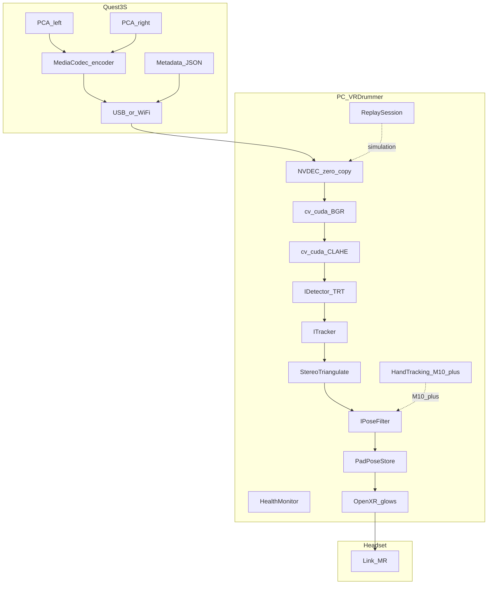

# VRDrummer — Design Document

**Version:** 6.0  
**Last updated:** June 2026  
**Repository:** [github.com/AbhijeetPatil5/VRDrummer](https://github.com/AbhijeetPatil5/VRDrummer)  
**Status:** Authoritative architecture and implementation reference

---

## Table of Contents

1. [Vision and Scope](#1-vision-and-scope)
2. [Architecture](#2-architecture)
3. [Cross-Cutting Infrastructure](#3-cross-cutting-infrastructure)
4. [Transport Pathways](#4-transport-pathways)
5. [Technology Stack and Interfaces](#5-technology-stack-and-interfaces)
6. [Module Specifications](#6-module-specifications)
7. [Phased Adoption Tiers](#7-phased-adoption-tiers)
8. [Build Roadmap](#8-build-roadmap)
9. [Latency and Bandwidth Budget](#9-latency-and-bandwidth-budget)
10. [Development Guide](#10-development-guide)
11. [Open Questions](#11-open-questions)
12. [Glossary and Document History](#12-glossary-and-document-history)

---

## 1. Vision and Scope

### Vision

VRDrummer teaches novice drummers using mixed reality. The player wears a Meta Quest 3S,
sees their real Simmons Titan 50 B-EX through passthrough, and receives circular glow cues
on each physical pad. Strikes are captured via real drumsticks (USB MIDI — not VR
controllers). Timing feedback and song charts come **last**, after perception works reliably.

### Nomenclature

| Term | Meaning | Example |
|------|---------|---------|
| **Phase** | High-level project stage in the roadmap summary | Phase 2 = Streaming and infrastructure |
| **Milestone** | Specific deliverable with acceptance tests | `2a`, `4c`, `10` |
| **Tier** | Allowed technology complexity — not schedule | Tier 2 permits NVDEC + TensorRT |

Phases group milestones. Tiers cap which technologies may be used in a milestone.

### Hardware

Substitutes are acceptable; this is the reference configuration.

| Component | Choice |
|-----------|--------|
| CPU | AMD 7800X3D |
| GPU | RTX 4080 Super |
| OS | Windows 11 |
| VR headset | Meta Quest 3S, developer mode, Horizon OS v74+ |
| Link (MR display) | Wired USB-C ≥ 2 Gbps |
| Drum kit | Simmons Titan 50 B-EX (USB MIDI) |

### Software

| Component | Choice |
|-----------|--------|
| Language | C++17 |
| Build | CMake ≥ 3.20 |

### Roadmap Summary (by Phase)

| Phase | Milestones | Deliverable |
|-------|------------|-------------|
| **1 — Foundation** | 1a–1b | MIDI on PC; OpenXR instance on PC |
| **2 — Streaming & infrastructure** | 2a–2e | Camera paths; record/replay; config; time; health; simulation |
| **3 — Perception** | 3–8 | Kit detect → pad ID → pose filter → MR glows → robustness → MVP gate |
| **4 — Gameplay** | 9–13 | MIDI merge, charts, scoring, latency lab, import **(deferred)** |

### Perception MVP (First "It Works" Moment)

- Live passthrough camera frames decoded on PC (RTX 4080 Super)
- Drum kit localised; all 14 Simmons pads identified
- Stable pad poses via pluggable pose filter (default EKF)
- Glow circles composited over real pads via OpenXR passthrough layers
- **No chart or timing logic required**

### Design Constraints (claims vs facts)

| Claim | Status |
|-------|--------|
| PCA frames available to PC OpenXR app via `XR_FB_passthrough` | **False** — compositor display only; use camera-fgs or WebRTC |
| camera-fgs uses software H.264 encode | **False** — already HW MediaCodec; Tier 2 upgrade = HEVC + tuning |
| Meta PCA API provides stereo extrinsics | **False** — per-camera intrinsics only; need `cv::stereoCalibrate` harness |
| TensorRT IOBinding == ORT IOBinding | **False** — Tier 2 target uses native TRT `enqueueV3` bindings |
| Tier 2 CV total ~45–55 ms = end-to-end glass-to-glow | **Partial** — inference path only; full loop ~70–90 ms typical |

---

## 2. Architecture

### Foundation Principle

Six stages where latency accumulates. All stages stamp events on the [unified time domain](#unified-time-domain) (§3).

```text
[1 Capture]        PCA on Quest (~30 fps, ~40–60 ms glass-to-texture)
[2 Encode]         MediaCodec HW on Snapdragon XR2 Gen 2 (H.264 → HEVC at Tier 2)
[3 Transport]      Quest → PC: USB adb TCP (Path A) or Wi-Fi WebRTC (Path B)
[4 Decode+Pre]     NVDEC on GPU → cv::cuda color convert → zero-copy
[5 Infer+Estimate] YOLO11n-seg → tracker → stereo triangulation → IPoseFilter
[6 Display]        OpenXR passthrough + glow projection layers → Link → headset
```

**Poses never leave PC RAM.** Only composited MR frames travel back to the headset.
No video is sent back for display.

### Dual Pipeline (Critical — Do Not Conflate)

| Pipeline | Direction | Payload |
|----------|-----------|---------|
| **CV video** | Quest → PC | Compressed PCA frames (~8–20 Mbps) |
| **MR display** | PC → Quest | Passthrough compositor + glow geometry via Link |
| **Pad poses** | PC internal | 14 × `{position, normal, radius}` — **not networked** |

### System Diagram (Target State)



### Coordinate Frames

All geometry uses an explicit transform tree (`TransformTree`). Every module documents
which frame its inputs and outputs use.

```text
QuestTrackingFrame   — Meta SLAM / OpenXR tracking origin
LeftCameraFrame      — PCA left eye optical centre
RightCameraFrame     — PCA right eye optical centre
WorldFrame           — OpenXR stage / local floor space (xrLocateSpace)
DrumKitFrame         — Origin on kit (user-calibrated or auto from kit detector)
PadFrame             — Per-pad local frame (normal = +Z)
```

Typical chain for a pad centroid:

```text
PadFrame → DrumKitFrame → WorldFrame → view/projection (glow render)
LeftCameraFrame → WorldFrame (via metadata pose + stereo_calib.json)
```

References: [QuestStereoMatching](https://github.com/t-34400/QuestStereoMatching),
[CameraToWorld sample](https://github.com/oculus-samples/Unity-PassthroughCameraApiSamples/tree/main/Assets/PassthroughCameraApiSamples/CameraToWorld).

Use PCA-provided **intrinsics and per-camera pose** from
[MRUK `PassthroughCameraAccess`](https://developers.meta.com/horizon/documentation/unity/unity-pca-documentation/)
— do **not** hardcode baseline or focal length.

### 3D Localisation Strategy

| Stage | Method | Milestones |
|-------|--------|------------|
| Bootstrap | Mono PCA + intrinsics + OpenXR head pose → ray cast | 3–4 |
| Target | Stereo PCA → rectify → triangulate | 2c+, 5 |
| Replay tuning | Same pipeline on recorded sessions (no headset) | 2e, 4, 5 |

### OpenXR Display (PC via Link)

| Step | API | Doc |
|------|-----|-----|
| Extensions | `XR_FB_passthrough`, `XR_KHR_D3D11_enable`, `XR_FB_color_space`, `XR_EXT_hand_tracking` | [Meta passthrough](https://developers.meta.com/horizon/documentation/native/android/mobile-passthrough/) |
| D3D11 bind | `xrGetD3D11GraphicsRequirementsKHR` → `XrGraphicsBindingD3D11KHR` | [Khronos D3D11](https://registry.khronos.org/OpenXR/specs/1.1/man/html/XrGraphicsBindingD3D11KHR.html) |
| Color space | `xrSetColorSpaceFB(XR_COLOR_SPACE_RIFT_CV1_FB)` after session create | [XR_FB_color_space](https://registry.khronos.org/OpenXR/specs/1.1/man/html/XR_FB_color_space.html) |
| Layers | `XrCompositionLayerPassthroughFB` + `XrCompositionLayerProjection` | [XrPassthrough sample](https://github.com/meta-quest/Meta-OpenXR-SDK/tree/main/Samples/XrSamples/XrPassthrough) |
| Hand tracking | `xrLocateHandJointsEXT` → wrist prior into filter | M10+ only |
| Link setup | Developer Runtime + Passthrough over Link beta | [Passthrough over Link](https://developers.meta.com/horizon/documentation/native/android/mobile-passthrough-over-link/) |

---

## 3. Cross-Cutting Infrastructure

Built in **Phase 2** (milestone **2e**) before heavy perception work. Enables regression
testing, headless development, and repeatable filter tuning.

### Unified Time Domain

Single monotonic `timestamp_ns` lineage. Every pipeline stage records `StageTimestamp`
events for latency breakdown and replay alignment.

```text
Capture → Encode → Transport → Decode → Preprocess → Infer → Track → Estimate → Render → MIDI
```

`src/core/TimeStamp.h` defines `ClockDomain`, `StageTimestamp`, and helpers to compute
delta between stages. All latency budgets in §9 derive from this system.

### Configuration System

`config/config.yaml` centralises runtime tuning — no magic numbers in source.

```yaml
# Example — not exhaustive
stream:
  tcp_nodelay: true
  metadata_port: 18090
cv:
  yolo_confidence: 0.5
  clahe_enabled: false        # adaptive enable at milestone 7
  roi_crop_enabled: true
estimation:
  filter: ekf                 # ekf | ukf | fixed
  ekf_process_noise: 0.01
  ema_alpha: 0.3              # Tier 1 tracker fallback
replay:
  dataset_dir: ./datasets/
health:
  log_interval_ms: 1000
```

Loaded once at startup; hot-reload via ImGui in debug builds.

### Record, Replay, and Benchmark

```text
recording/
├── VideoRecorder.cpp       # H.264/HEVC elementary stream + sidecar index
├── MetadataRecorder.cpp    # JSON intrinsics/pose per frame
├── MidiRecorder.cpp        # timestamped Note-On events
├── ReplaySession.cpp       # feeds IVideoTransport from file (simulation mode)
└── BenchmarkRunner.cpp     # batch replay + metrics CSV
```

**Simulation mode:** `ReplaySession` implements `IVideoTransport` so CV, estimation,
and filter code run without a Quest attached. Synthetic MIDI injects through the same
queue as live RtMidi.

**Regression datasets:** Named folders (`datasets/session_YYYYMMDD/`) with video,
metadata, optional MIDI, and ground-truth annotations for benchmark reruns.

### Runtime Health Monitoring

`src/core/HealthMonitor.h` aggregates per-frame metrics; ImGui panel in debug builds.

| Metric | Use |
|--------|-----|
| Dropped frames | Ring buffer overflow / decode backlog |
| Decode failures | FFmpeg/NVDEC error count |
| Stereo sync offset | Left/right timestamp delta (target ≤ 33 ms) |
| Tracker confidence | Mean detection score per frame |
| Filter innovation | EKF/UKF residual magnitude |
| Queue depths | stream / cv / estimation ring buffers |
| End-to-end latency | Capture timestamp → render submit |

### Thread Architecture (AMD 7800X3D)

Pin threads to separate physical cores. Avoid `xr_thread` and `cv_thread` on the same core.

| Thread | Role | Priority |
|--------|------|----------|
| `stream_thread` | TCP recv + NVDEC decode | HIGH |
| `cv_thread` | CLAHE + detector + tracker + triangulation | HIGH |
| `estimation_thread` | `IPoseFilter` update | NORMAL |
| `xr_thread` | OpenXR frame loop + D3D11 render | REALTIME |
| `midi_thread` | RtMidi callback (milestone 9+) | HIGH |
| `health_thread` | Periodic metric rollup (optional) | LOW |

Use `SetThreadAffinityMask` (Windows) per thread.

### Repository Layout (top level)

```text
VRDrummer/
├── companion/
│   ├── camera-fgs-fork/           # HEVC + stereo + UDP (Tier 2)
│   └── QuestCameraKit-scene/      # Wi-Fi WebRTC (Tier 3)
├── calibration/                   # Stereo harness (milestone 2c)
├── config/config.yaml
├── recording/                     # Record / replay / benchmark (milestone 2e)
├── docs/DESIGN_v6.md
├── src/
│   ├── core/                      # TimeStamp, TransformTree, HealthMonitor
│   ├── stream/                    # IVideoTransport, decoders
│   ├── cv/                        # IDetector, IKitDetector, ITracker
│   ├── estimation/                # IPoseFilter implementations
│   ├── xr/ + render/
│   ├── midi/
│   └── timing/                    # deferred gameplay
├── third_party/
├── midiTest.cpp
├── vrTest.cpp
└── CMakeLists.txt
```

---

## 4. Transport Pathways

Build **USB first (Path A)**. Wi-Fi **(Path B)** only after Path A acceptance tests pass.
Implementation uses `IVideoTransport`; live and replay sources are interchangeable.

### Path A — USB (Primary)

**Use when:** Daily development; lowest jitter; Link + PCA simultaneously.

| Layer | Tier 1 (bootstrap) | Tier 2+ (target) | Package / command |
|-------|-------------------|------------------|-------------------|
| Capture | PCA foreground service | Same | [camera-fgs](https://github.com/t-34400/camera-fgs) APK |
| Encode | `MediaCodec` H.264 HW | **HEVC HW** + latency keys | Android [MediaCodec](https://developer.android.com/reference/android/media/MediaCodec) |
| Encoder tuning | Default | `KEY_LATENCY=0`, `KEY_PREPEND_HEADER_TO_SYNC_FRAMES=1`, `KEY_I_FRAME_INTERVAL=1` | [MediaFormat](https://developer.android.com/reference/android/media/MediaFormat) |
| Transport | TCP `adb forward` | Same; optional UDP/RTP fork | `adb forward tcp:18081 tcp:8081` (left), `18082→8082` (right) |
| Metadata | TCP port `18090` | Same; optional dedicated UDP | JSON intrinsics/pose; never blocks video |
| PC receive | BSD sockets | `TCP_NODELAY` + small recv buffer | Reduces Nagling on localhost forward |
| Decode | FFmpeg CPU | FFmpeg **NVDEC** (`h264_cuvid` / `hevc_cuvid`) | [NVIDIA FFmpeg](https://docs.nvidia.com/video-technologies/video-codec-sdk/13.1/ffmpeg-with-nvidia-gpu/index.html) |
| Debug preview | — | JPEG ports `19091`/`19092` (camera-fgs) | ImGui preview without touching H.264 path |
| Verify | ffplay | — | [camera-fgs README](https://github.com/t-34400/camera-fgs) |

**camera-fgs already uses HW MediaCodec H.264.** Tier 2 upgrade is **HEVC + latency tuning**,
not software → hardware.

**Link coexistence:** camera-fgs exists because
[PCA is not supported over Link](https://developers.meta.com/horizon/documentation/native/android/pca-native-overview/)
as an app-facing API.

**PCA resolution (Horizon OS v83+):** Probe at runtime — do not hardcode.

| Resolution | Aspect | Use case |
|------------|--------|----------|
| 1280 × 960 | 4:3 | Standard horizontal coverage |
| 1280 × 1280 | 1:1 | Taller FOV; kick / floor toms |

Test both in milestone **2a**; handle aspect in YOLO letterboxing.

**Stereo fallback:** If 30 fps stereo overloads encode, drop to **15 fps per eye** — pads are static.

### Path B — Wi-Fi (Secondary)

**Use when:** USB proven; untethered camera desired. Keep **wired Link for MR** during Wi-Fi CV testing.

| Layer | Implementation | Package |
|-------|----------------|---------|
| Capture | PCA via Unity companion | [QuestCameraKit](https://github.com/xrdevrob/QuestCameraKit) |
| Signaling | WebSocket on LAN | [NativeWebSocket](https://github.com/endel/NativeWebSocket) |
| Transport | WebRTC SRTP/RTP | [libdatachannel](https://github.com/paullouisageneau/libdatachannel) |
| PC receive | `PeerConnection` + `H264RtpDepacketizer` | [media-receiver example](https://github.com/paullouisageneau/libdatachannel/blob/master/examples/media-receiver/main.cpp) |
| Decode | Same stack as USB | — |

**Wi-Fi tuning (mandatory):**

- Quest + PC on same **5 / 6 GHz AP**; no mesh extender hop
- SDP: **H.264 Constrained Baseline** (`profile-level-id=42e01f`)
- PC receiver: **disable jitter buffer** (libdatachannel `rtc::Configuration` — see open question Q6)
- Without tuning, default WebRTC adds 200–400 ms playout delay

**Research (post-MVP):** AoA direct bulk USB — Android `UsbAccessory`, PC `WinUSB` / `libusb`.

---

## 5. Technology Stack and Interfaces

### Interface Contracts

Abstractions allow swapping implementations without rewriting the pipeline.

```cpp
// Transport — live USB, live WebRTC, or replay file
class IVideoTransport {
public:
    virtual bool start() = 0;
    virtual void stop() = 0;
    virtual bool readFrame(Frame& out) = 0;  // latest-frame-wins; non-blocking
};

// Kit localisation — coarse ROI before pad segmentation
class IKitDetector {
public:
    virtual bool detect(const Frame& in, cv::Rect& roi_out) = 0;
};
// Implementations: ContourKitDetector (Tier 1), YoloKitDetector (Tier 2)

// Pad segmentation / detection
class IDetector {
public:
    virtual std::vector<PadDetection> detect(const Frame& in, const cv::Rect& roi) = 0;
};
// Implementations: YoloOnnxDetector (Tier 1), TensorRtDetector (Tier 2)

// Detection stabilisation between detector and pose filter
class ITracker {
public:
    virtual std::vector<TrackedPad> update(const std::vector<PadDetection>& dets) = 0;
};
// Implementations: ClassLockTracker + EMA (Tier 1), SortTracker, ByteTrackTracker (Tier 2)

// Pose estimation / smoothing
class IPoseFilter {
public:
    virtual void predict(double dt) = 0;
    virtual void update(const TrackedPad& measurement) = 0;
    virtual PadPose getPose(int pad_id) const = 0;
};
// Implementations: FixedPoseFilter, EkfPoseFilter, UkfPoseFilter
```

`Frame` carries `cv::cuda::GpuMat gpu_bgr`, `timestamp_ns`, and `CameraId` (LEFT/RIGHT).

### PC Application Stack

| Component | Tier 1 | Tier 2–3 | Link |
|-----------|--------|----------|------|
| Build | CMake ≥ 3.20 | Same | [cmake.org](https://cmake.org/download/) |
| OpenXR | 1.1.59.1 | + `XR_FB_color_space`, `XR_EXT_hand_tracking` | [OpenXR-SDK](https://github.com/KhronosGroup/OpenXR-SDK/releases/tag/release-1.1.59.1) |
| Graphics | D3D11 + GLM | Same | [XR_KHR_D3D11_enable](https://registry.khronos.org/OpenXR/specs/1.1/man/html/XR_KHR_D3D11_enable.html) |
| Decode | FFmpeg CPU | FFmpeg NVDEC | [NVIDIA FFmpeg](https://docs.nvidia.com/video-technologies/video-codec-sdk/13.1/ffmpeg-with-nvidia-gpu/index.html) |
| Preprocess | OpenCV CPU | OpenCV CUDA + CLAHE | Requires CUDA build — not pip wheel |
| Inference | ONNX Runtime CUDA EP | TensorRT `.engine` FP16 → INT8 | [Ultralytics TensorRT](https://docs.ultralytics.com/integrations/tensorrt/) |
| Middle step | — | ORT TensorRT EP or ORT IOBinding | [ORT TRT EP](https://onnxruntime.ai/docs/execution-providers/TensorRT-ExecutionProvider.html) |
| Model | YOLO11n-seg ONNX | YOLO11n-seg TensorRT INT8 | [Ultralytics](https://github.com/ultralytics/ultralytics) |
| Estimation | `FixedPoseFilter` or `EkfPoseFilter` | + stereo; compare via `IPoseFilter` | [Eigen](https://gitlab.com/libeigen/eigen/-/releases) |
| MIDI | RtMidi 6.0.0 | Same | [rtmidi](https://github.com/thestk/rtmidi/releases/tag/6.0.0) |
| Debug | Dear ImGui, nlohmann/json | + HealthMonitor panel | [imgui](https://github.com/ocornut/imgui) |
| Labeling | CVAT | Same | [cvat-ai/cvat](https://github.com/cvat-ai/cvat) |

### Quest Companion

| Role | Tier 1 | Tier 2+ | Link |
|------|--------|---------|------|
| Stream app | camera-fgs H.264 mono | Fork: HEVC stereo + low-latency keys | [camera-fgs](https://github.com/t-34400/camera-fgs) |
| Wi-Fi alt | — | QuestCameraKit WebRTC | [QuestCameraKit](https://github.com/xrdevrob/QuestCameraKit) |
| Stereo ref | — | [UXR.QuestCamera](https://uralstech.github.io/UXR.QuestCamera/) | Dual-eye PCA |

### Inference Export (RTX 4080 Super)

```bash
yolo train model=yolo11n-seg.pt data=drum_pads.yaml
yolo export model=runs/segment/train/weights/best.pt format=onnx

yolo export model=best.pt format=engine half=True device=0   # validate FP16 first
yolo export model=best.pt format=engine int8=True data=drum_pads.yaml device=0
```

C++ reference: [YOLOv8-ONNXRuntime-CPP](https://github.com/ultralytics/ultralytics/tree/main/examples/YOLOv8-ONNXRuntime-CPP).

**Build requirements:** FFmpeg with `--enable-nvdec`; OpenCV with CUDA for `cv::cuda::*`.

---

## 6. Module Specifications

Each module documents bootstrap (Tier 1) vs target (Tier 2) behaviour inline.

### Module: `stream`

**Input:** Compressed H.264/HEVC from Quest or replay file  
**Output:** `Frame` in ring buffer  
**Policy:** Latest-frame-wins — CV never blocks on stale frames

**Tier 1 — CPU decode:**

```cpp
AVCodec* dec = avcodec_find_decoder(AV_CODEC_ID_H264);
// avcodec_send_packet → avcodec_receive_frame → sws_scale → cv::Mat → upload GpuMat
```

**Tier 2 — NVDEC zero-copy:**

```cpp
av_hwdevice_ctx_create(&hw_device_ctx, AV_HWDEVICE_TYPE_CUDA, ...);
// h264_cuvid / hevc_cuvid → AV_PIX_FMT_CUDA (NV12 on GPU)
cv::cuda::cvtColor(nv12_gpu, bgr_gpu, cv::COLOR_YUV2BGR_NV12);
```

**Tier 2 — inference binding (ORT middle step):**

```cpp
Ort::IoBinding binding(session);
binding.BindInput("images", Ort::Value::CreateTensor(memory_info_cuda, bgr_gpu.ptr<uchar>(), ...));
session.Run(Ort::RunOptions{nullptr}, binding);
```

**Tier 2 — inference binding (TRT target):**

```cpp
context->setTensorAddress("images", bgr_gpu.ptr<void>());
context->enqueueV3(cuda_stream);  // overlap decode N+1 with infer N
```

**Metadata side channel** (port `18090` or WebRTC DataChannel):

```json
{
  "timestampNs": 1234567890123,
  "camera": "left",
  "intrinsics": { "fx": 0.0, "fy": 0.0, "cx": 0.0, "cy": 0.0, "distortion": [0,0,0,0,0] },
  "cameraPose": { "position": [0,0,0], "orientation": [0,0,0,1] }
}
```

Stereo pairs: timestamps within **≤ 33 ms**. Log offset in HealthMonitor.

### Module: `cv`

**Input:** `Frame` from `stream`  
**Output:** `std::vector<TrackedPad>` via `IDetector` + `ITracker`

| Stage | Tier 1 | Tier 2 |
|-------|--------|--------|
| Contrast | None | CLAHE (`cv::cuda`); adaptive at milestone 7 |
| Kit ROI | `IKitDetector` contours | YOLO `drum_kit` class; **crop before seg** (~50% pixels) |
| Pad detect | `YoloOnnxDetector` | `TensorRtDetector` INT8 |
| Centroid | Bbox centre | Mask centroid |
| Stabilise | `ClassLockTracker` + EMA (α≈0.3) | `ByteTrackTracker` or `SortTracker` |
| 3D | Mono ray + head pose | Stereo triangulation |
| Letterbox | Per-frame | **Cached** transform + reused GPU buffer |

**CLAHE** (milestone 7 — adaptive): enable when frame luminance variance drops below threshold.

**Stereo triangulation** (requires `stereo_calib.json` from milestone **2c**):

```cpp
cv::cuda::remap(left_gpu, rect_left, map1_left_gpu, map2_left_gpu, cv::INTER_LINEAR);
cv::Ptr<cv::cuda::StereoBM> bm = cv::cuda::createStereoBM(64);
bm->compute(rect_left, rect_right, disparity_gpu);
cv::cuda::reprojectImageTo3D(disparity_gpu, points3D_gpu, Q_gpu);
```

Do **not** hardcode stereo baseline — read `t` from `stereo_calib.json`.

### Module: `calibration` (milestone 2c)

1. `capture_stereo_pairs.exe` — save synced `left_NNNN.png` / `right_NNNN.png` (≥ 20 pairs)
2. 9×6 asymmetric checkerboard at known square size
3. `calibrate_stereo.py` → `stereo_calib.json` (`cv2.stereoCalibrate` with `CALIB_FIX_INTRINSIC`)

Loaded at startup by `StereoCalib.cpp`. Required before milestone **5** stereo fusion.

### Module: `estimation`

**Input:** `TrackedPad` + OpenXR poses (+ wrist joints at M10+)  
**Output:** `PadPose[14]` in `WorldFrame`

Default filter: `EkfPoseFilter` with state \[x, y, z, v_x, v_y, v_z\].

| Filter | When |
|--------|------|
| `FixedPoseFilter` | Bootstrap; replay baseline comparison |
| `EkfPoseFilter` | Default production |
| `UkfPoseFilter` | Optional; compare on replay datasets at milestone 5 |

**Replay-based tuning (milestone 5):** Run recorded sessions through `ReplaySession`;
compare filter outputs; tune `ekf_process_noise` and measurement weights in `config.yaml`
without wearing the headset.

**Interpolation:** CV updates at ~10–30 Hz; render at 90 Hz. Interpolate `PadPose[14]` to
`xrTimeToDisplayTime` from `XrFrameState` — not raw capture timestamp.

### Module: `xr` + `render`

```cpp
const char* extensions[] = {
    "XR_FB_passthrough", "XR_KHR_D3D11_enable",
    "XR_FB_color_space", "XR_EXT_hand_tracking"
};
```

**Frame loop:**

```text
xrWaitFrame → xrBeginFrame
  xrLocateSpace / xrLocateViews
  xrLocateHandJointsEXT          // M10+ only
  interpolate PadPose → xrTimeToDisplayTime
  build glow quads from PadPose
xrEndFrame: PassthroughFB + Projection layers
```

Glow: world-space circle at `PadPose.position`, normal `PadPose.normal`. No screen-space HUD.

### Module: `midi`

| Item | Status |
|------|--------|
| RtMidi 6.0.0 + Simmons 14-pad map | Done ([midiTest.cpp](../midiTest.cpp)) |
| Lock-free `HitEvent` queue in unified app | Milestone 9 |

### Module: `timing` (deferred — Phase 4)

Hardcoded chart (M9), scoring (M11), `.mid` parse (M13), tempo map.

---

## 7. Phased Adoption Tiers

Tiers define **technology ceiling** — not schedule. Do not skip tiers.

| Tier | Milestones | Capability ceiling |
|------|------------|-------------------|
| **1 — Bootstrap** | 2a, 2e, 3, 4 | CPU decode, ONNX seg, mono 3D, replay/simulation, EMA tracker |
| **2 — Performance** | 2b–2c, 4b–4c, 5–8 | NVDEC, stereo, TRT, ByteTrack, CLAHE, glows, health metrics |
| **3 — Transport** | 2d | Wi-Fi WebRTC path |
| **4 — Gameplay** | 9–13 | MIDI timing, charts, scoring, hand prior |
| **Research** | Post-MVP | AoA USB, NVDEC→D3D11 shared handle |

---

## 8. Build Roadmap

**Estimate:** Phase 3 (perception) ≈ 5–8 months; Phase 4 (gameplay) ≈ 3–5 months after.

### Phase 1 — Foundation

#### 1a — MIDI + drum kit map (Done)

| Deliverable | RtMidi 14-pad Simmons map |
|-------------|---------------------------|
| **Acceptance** | Note-On prints correct pad name for all 14 pads |

#### 1b — OpenXR probe (Partial)

| Deliverable | Instance + `xrCreatePassthroughFB` proc load |
|-------------|-----------------------------------------------|
| **Acceptance** | `vrTest.exe` creates instance with `XR_FB_passthrough`; no session yet |

---

### Phase 2 — Streaming and infrastructure

#### 2a — USB camera stream bootstrap (Tier 1)

| Deliverable | Left eye H.264, CPU FFmpeg decode, `IVideoTransport`, ImGui preview |
|-------------|----------------------------------------------------------------------|
| **Acceptance** | camera-fgs + Link + PC concurrent 10 min; ≥ 15 fps decoded 60 s; ffplay recipe works; 1280×960 and 1280×1280 probed; per-stage latency logged via unified time |

#### 2b — NVDEC zero-copy (Tier 2)

| Deliverable | NVDEC → NV12 → `cv::cuda` BGR; optional ORT IOBinding |
|-------------|--------------------------------------------------------|
| **Acceptance** | GPU decode < 2 ms avg; no host memcpy between decode and infer; CUDA stream overlap prototype |

#### 2c — Stereo + metadata + calibration (Tier 2)

| Deliverable | Dual adb ports; metadata port `18090`; `stereo_calib.json` |
|-------------|-------------------------------------------------------------|
| **Acceptance** | Both eyes ≥ 15 fps 60 s; metadata JSON per frame; L/R sync ≤ 33 ms; ≥ 20 checkerboard pairs → valid `stereo_calib.json`; rectify maps load at startup |

#### 2d — Wi-Fi WebRTC (Tier 3)

| Deliverable | QuestCameraKit → libdatachannel; CBP + low jitter |
|-------------|---------------------------------------------------|
| **Acceptance** | ≥ 15 fps; SDP `profile-level-id=42e01f`; p95 ≤ 2× p50 vs USB; same detector output ±1 frame |

#### 2e — Record, replay, config, time, health, simulation (Tier 1)

| Deliverable | `recording/` pipeline; `config.yaml`; `TimeStamp`; `HealthMonitor`; `ReplaySession` as `IVideoTransport` |
|-------------|-------------------------------------------------------------------------------------------------------------|
| **Acceptance** | Record 60 s session (video + metadata + MIDI); replay drives CV pipeline without Quest; benchmark CSV export; health panel shows drops + E2E latency; simulation mode documented |

---

### Phase 3 — Perception

#### 3 — Kit detection + ROI crop (Tier 1)

| Deliverable | `IKitDetector`; ROI crop before segmentation |
|-------------|---------------------------------------------|
| **Acceptance** | Kit ROI contains all pads on recorded + live sessions; crop reduces infer pixels ≥ 30% |

#### 4 — Pad ID 14-class segmentation (Tier 1→2)

| Deliverable | YOLO11n-seg ONNX; CVAT labels; train on RTX 4080 Super |
|-------------|--------------------------------------------------------|
| **Acceptance** | ≥ 90% class accuracy on held-out replay dataset; masks on all 14 pads in live session |

#### 4b — TensorRT engine (Tier 2)

| Deliverable | FP16 engine validated; INT8 if needed |
|-------------|--------------------------------------|
| **Acceptance** | FP16 infer < 8 ms; INT8 only if FP16 insufficient; static `imgsz` enforced |

#### 4c — Detection stabilisation (Tier 2)

| Deliverable | `ITracker` — EMA/class-lock (T1) → ByteTrack (T2) |
|-------------|-----------------------------------------------------|
| **Acceptance** | No pad ID swaps > 1 frame on 5 min recorded session; spurious detections dropped |

#### 5 — Pose estimation + replay tuning (Tier 2)

| Deliverable | `IPoseFilter`; stereo triangulation; filter comparison on replay |
|-------------|------------------------------------------------------------------|
| **Acceptance** | All 14 `PadPose` stable on live kit; replay benchmark: EKF vs UKF vs Fixed logged; noise tuned via config; stereo depth error < 5 cm on known pad spacing |

#### 6 — MR glow overlays (Tier 2)

| Deliverable | XrPassthrough + D3D11 projection; `xrTimeToDisplayTime` |
|-------------|--------------------------------------------------------|
| **Acceptance** | Glows align with pads within 2 cm visual error; no hue shift with `XR_FB_color_space`; 90 Hz render with interpolated poses |

#### 7 — Robustness (Tier 2)

| Deliverable | Adaptive CLAHE; filter dropout recovery; EKF noise profiles |
|-------------|--------------------------------------------------------------|
| **Acceptance** | Recovery < 2 s after 5 s occlusion; dim-room session passes on replay dataset |

#### 8 — Perception MVP integration gate (Tier 2)

| Deliverable | End-to-end: stream → detect → estimate → glow; regression benchmark suite |
|-------------|---------------------------------------------------------------------------|
| **Acceptance** | 10 min live session without crash; benchmark suite runs on CI/replay; perception MVP checklist (§1) satisfied |

---

### Phase 4 — Gameplay (deferred)

| ID | Milestone | Key deliverable |
|----|-----------|-----------------|
| 9 | MIDI merge | Lock-free hit queue in unified app |
| 10 | Chart + predictive glow | Hand wrist prior into `IPoseFilter` |
| 11 | Scoring flashes | ±25 ms green/red/purple; E2E ≤ 30 ms strike-to-flash |
| 12 | Latency lab | ImGui HUD; full timing breakdown |
| 13 | `.mid` / `.pdf` import | libsmf / PDF viewer |

---

## 9. Latency and Bandwidth Budget

All measurements use the unified time domain (§3). Values are reference targets on USB Path A.

### CV Pipeline (USB, Tier 2 target)

| Stage | Tier 1 | Tier 2 | Tier 2 notes |
|-------|--------|--------|--------------|
| PCA capture | ~33 ms | ~33 ms | ~30 fps fixed |
| Quest encode | ~5–15 ms | ~5–8 ms | HEVC + `KEY_LATENCY=0` |
| Transport | ~1–5 ms | ~1–3 ms | `TCP_NODELAY`; optional metadata UDP |
| NVDEC decode | 5–8 ms CPU | **< 2 ms** | Zero-copy; CUDA stream overlap |
| NV12 → BGR | 1–3 ms CPU | **< 0.5 ms** | On-GPU |
| CLAHE | N/A | **< 1 ms** | Adaptive at M7 |
| YOLO infer | 15–30 ms ORT | **3–8 ms** | TRT INT8; ROI crop 2–3× speedup |
| Tracker | ~0.1 ms | ~0.5 ms | EMA vs ByteTrack |
| Pose filter | < 1 ms | < 1 ms | Eigen3 |
| **CV subtotal** | **~60–100 ms** | **~45–55 ms** | Inference path only |
| **Glass-to-glow** | — | **~70–90 ms** | Includes display path below |

### Display Path

| Stage | Budget |
|-------|--------|
| Glow render + OpenXR submit | 11 ms (90 Hz) |
| Link encode / decode | 5–15 ms |
| Pose update for glows | CV rate (~10–30 Hz); interpolate to `xrTimeToDisplayTime` at 90 Hz |

### Bandwidth

| Stream | Bitrate |
|--------|---------|
| Mono H.264 1280×960 @ 30 fps | ~8–15 Mbps |
| Stereo HEVC Tier 2 | ~10–20 Mbps |
| Video back to Quest | **0** (compositor handles passthrough) |

### Strike Timing (Phase 4 only)

MIDI scoring target **≤ 30 ms** strike-to-flash (milestone 11). CV latency need not meet
this until chart-driven predictive glow (milestone 10).

---

## 10. Development Guide

### AI Tutor Model

- **Tutor, not author** — pseudocode first; you implement and debug
- Per topic: Prerequisites → Intuition → Math → Procedure → Verification
- When stuck: guiding questions first, not full solutions

### Learning Tracks

| Track | Topics | Milestones |
|-------|--------|------------|
| A — Foundation | MIDI, OpenXR | 1a–1b |
| B — Streaming | PCA, FFmpeg, NVDEC, TCP/WebRTC, replay | 2a–2e |
| C — CV/ML | Labelling, YOLO, ONNX, TRT, trackers, 2D→3D | 3–4c |
| D — Estimation | `IPoseFilter`, stereo, replay tuning | 5 |
| E — MR | Passthrough, D3D11, color space | 6 |
| F — Gameplay | MIDI timing, charts | 9–13 (deferred) |

### Current Codebase

| File | Status | Notes |
|------|--------|-------|
| [midiTest.cpp](../midiTest.cpp) | Done | RtMidi; 14-pad Simmons map |
| [vrTest.cpp](../vrTest.cpp) | Partial | Instance + passthrough proc load |
| [CMakeLists.txt](../CMakeLists.txt) | Done | FetchContent: OpenXR 1.1.59.1, RtMidi 6.0.0 |

```powershell
mkdir build; cd build
cmake ..
cmake --build . --config Release
# Outputs: midiTest.exe, vrTest.exe
```

### Simmons MIDI Map

| Note | Pad |
|------|-----|
| 36 | Kick Drum |
| 38 | Snare Centre |
| 40 | Snare Rim |
| 41–48 | Toms / Hi-Hat variants |
| 49, 57 | Crash / Crash 2 |
| 51 | Ride |
| 85–86 | Hi-Hat Splash / Semi-Open |

---

## 11. Open Questions

| # | Question | Milestone |
|---|----------|-----------|
| 1 | Does 1280×1280 cover all 14 pads from seated position? | 2a |
| 2 | Does camera-fgs stereo survive Link active on HzOS v74–v83? | 2c |
| 3 | HEVC HW encode on XR2 Gen 2 in camera-fgs fork? | 2c |
| 4 | Link Beta tab missing on Link v83 — registry workaround? | 1b |
| 5 | AoA bulk USB on Quest 3S firmware? | Research |
| 6 | libdatachannel jitter buffer disable — which config field? | 2d |
| 7 | Classical CV vs YOLO for v1 kit ROI baseline? | 3 |
| 8 | `.pdf` scope — visual reference or parsed chart? | 13 |
| 9 | `XR_COLOR_SPACE_RIFT_CV1_FB` correct on Quest 3S? | 6 |
| 10 | StereoBM vs StereoSGM quality on drum pads? | 5 |
| 11 | QuestRealityCapture log format for replay alignment? | 2e |

---

## 12. Glossary and Document History

### Glossary

| Term | Definition |
|------|------------|
| **Phase** | High-level roadmap stage (1–4) grouping milestones |
| **Tier** | Technology complexity ceiling (1 Bootstrap → 4 Gameplay) |
| **Milestone** | Specific deliverable ID (e.g. `2a`, `5`) |
| **PCA** | Passthrough Camera API — Quest RGB via Android Camera2 |
| **IVideoTransport** | Abstract video source: USB, WebRTC, or replay |
| **IDetector** | Abstract pad segmentation backend (ONNX / TensorRT) |
| **IKitDetector** | Abstract kit ROI localisation |
| **ITracker** | Abstract detection stabiliser (EMA, SORT, ByteTrack) |
| **IPoseFilter** | Abstract pose smoother (Fixed, EKF, UKF) |
| **TransformTree** | Directed graph of coordinate frame transforms |
| **ReplaySession** | `IVideoTransport` implementation reading recorded sessions |
| **Simulation mode** | Full PC pipeline without Quest hardware |
| **HealthMonitor** | Runtime metrics aggregator (drops, latency, sync) |
| **Latest-frame-wins** | Ring buffer drops stale frames |
| **Zero-copy** | NVDEC → BGR → infer on GPU without host memcpy |
| **NVDEC** | NVIDIA hardware video decode on RTX GPU |
| **CBP** | H.264 Constrained Baseline Profile for low-latency WebRTC |
| **PadPose** | World-space position + normal + radius for one pad |
| **Path A / B** | USB adb TCP / Wi-Fi WebRTC |
| **Link** | Wired USB-C PC OpenXR on Quest |
| **XR_FB_passthrough** | Compositor passthrough — no raw pixels to PC app |

### Document History

| Version | Date | Summary |
|---------|------|---------|
| 1.0–4.1 | Jun 2026 | Iterative CV-first architecture; see prior `DESIGN.md` / v5.1 review doc |
| **6.0** | **Jun 2026** | **Full rewrite:** unified phase/milestone/tier nomenclature; integrated v5.0/v5.1 addenda (replay, frames, abstractions, config, health, simulation); milestone 2e infrastructure; `IPoseFilter`/`IDetector`/`ITracker` throughout; replay-based filter tuning at M5; optimizations absorbed into modules and latency table; no appendices |
